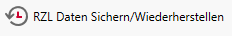
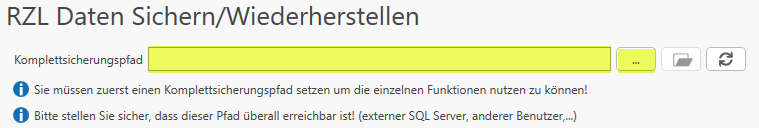
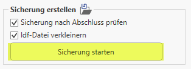
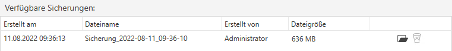
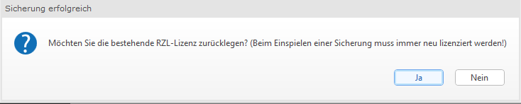
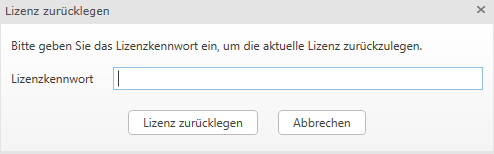

# RZL Daten sichern

Zunächst müssen **alle RZL - Programme auf dem Arbeitsplatz geschlossen werden**, damit die Sicherung gestartet werden kann!
Der RZL Dienst (wenn optional installiert) wird bei diesem Vorgang, vom RZL-Admin
in einen Diagnosemodus versetzt. Die Komplettsicherung umfasst auch die Sicherung der Datenbank.

Während der Sicherung können die RZL-Programme **NICHT** gestartet
werden.

Für eine Komplettsicherung führen Sie folgende Schritte aus:

**1.**  Öffnen Sie das Programm **RZL Admin**.

 
 

**2.**  Wählen Sie den Menüpunkt **RZL Daten Sichern/Wiederherstellen**.

**3.**  Geben Sie den Pfad für die Komplettsicherung an und stellen Sie sicher, dass dieser Pfad überall erreichbar ist (Netzlaufwerk).

**4.**  Klicken Sie auf **Sicherung starten**.

*Optional können hier zusätzliche Einstellungen vorgenommen werden:*

a) Die Sicherung soll nach Abschluss überprüft werden

b) Die Sicherungsdatei wird zu einer Idf-Datei komprimiert

**5.**  Sobald die Sicherung erstellt wurde, erscheint sie unter **Verfügbare Sicherungen**:

 

**6.**  Nach Abschluss der Sicherung werden Sie aufgefordert, die Lizenz zurückzulegen. Bestätigen Sie dies mit **Ja**.

(Siehe dazu auch [RZL Lizenzierung](lizenzierung.md))

Die Sicherungsdatei wird im Dateiformat `.rzlbak` und `.rzlbak_hash` im ausgewählten Komplettsicherungspfad abgelegt 
und kann dann in der neuen Umgebung (Server /Rechner) wiederhergestellt werden.

**Mitgesichert werden standardmäßig:**

- DataRepository
- Datenbank (optional)

**in abweichenden Fällen:**

- abweichende Datenverzeichnisse (sofern diese auf einem Netzwerkpfad liegen und erreichbar sind)

- abweichende RZL-Dokumente-Ordner

- aus der DokV+ gelöschte Dokumente (optional)

*Danach wird die Sicherung komprimiert (ein Netzwerkzugriff kann unter
Umständen länger dauern) und der Hash-Wert der Datei wird berechnet.*

!!! warning "zu beachten:"

    - Bitte achten Sie darauf, dass *lokale abweichende Datenordner*
     **nicht** mitgesichert werden. Die Dateien aus dem Data-Repository werden kopiert und komprimiert.
     Falls eine Datenbank-Installation vorhanden ist, werden die letzten bzw.
     aktuellsten **drei** **Datenbank-Backups** in die Sicherung übernommen.
     
     - Wenn kein Zugriff mehr auf die RZL-Programme besteht, finden Sie die Standardpfade einer Einzelplatz-Installation unter:
            **RZL Setup (alt):** `C:\ProgramData\RZLWIN`
            **RZL Setup:** `C:\ProgramData\RZL_DataRepository`
            
     - Die Sicherung einzelner Datendateien wird in den jeweiligen RZL Programmen gesichert und wiederhergestellt
        (bspw. bestimmte Datendateien z. B. Wirtschaftsjahre eines Klienten) 

**Die ZMV verwaltet die Klientenstammdaten und die RZL-Datendateien, ein Verschieben von Daten im Explorer führt zu inkonsistenten Datenständen innerhalb der RZL-Programme und sollte daher vermieden werden!**
