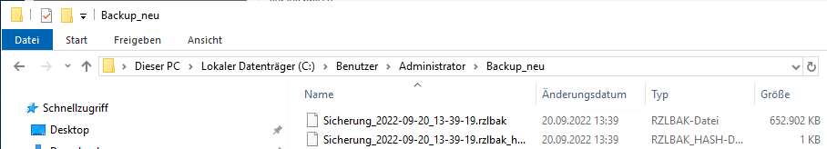
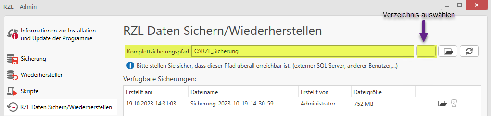
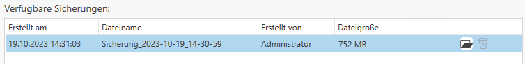
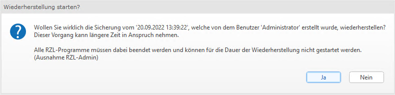
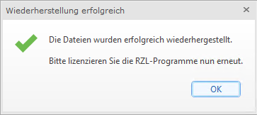

# RZL Daten wiederherstellen

Übernehmen Sie die zuvor gesicherten Dateien (*.rzlbak* und
*.rzlbak_hash*) und speichern Sie diese auf den Rechner
(lokale Installation), ins Netzwerk oder auf den Server.

Öffnen Sie den *RZL-Admin*.

Klicken Sie auf den Menüpunkt *RZL Daten Sichern/Wiederherstellen*.

Wählen Sie unter *Komplettsicherungspfad* das Verzeichnis, in welchem
die gesicherten Dateien gespeichert wurden.

Unter *Verfügbare Sicherungen* wird die zuvor erstellte Sicherung dargestellt.
Wählen Sie diese nun aus.

Wählen Sie aus, warum die Sicherung wiederhergestellt wird, und klicken
Sie anschließend auf *Wiederherstellung starten*.

### Unterschiede bei Wiederherstellungsgründen:
**Disaster Recovery oder Servertausch:**
Der häufigst genutzte Methode für die Wiederherstellung eines Echtdatensystems, Zugänge für KSV sowie Sync-Passwöter bleiben mit dieser Wiederherstellungsmethode *aktiv*. Die Finanzonline Anbindung bleibt *erhalten*.

**Test Installation Backupsystem:**
Diese Methode wird für Testumgebung sowie Systeme empfohlen, hier werden Zugänge für KSV sowie die Sync-Passwörter *gelöscht*. Die Finanzonline Anbindung wird *deaktiviert*.

Es öffnet sich ein Dialogfenster.

Nachdem Sie diese Meldung mit *Ja* bestätigt haben, wird die Sicherung
wiederhergestellt.

Führen Sie anschließend die [Lizenzierung](lizenzierung.md) der RZL-Programme aus.

!!! warning "Hinweis"  
    Alle RZL-Programme müssen beendet werden und können für die Dauer
    der Wiederherstellung nicht gestartet werden (Ausnahme: RZL-Admin).