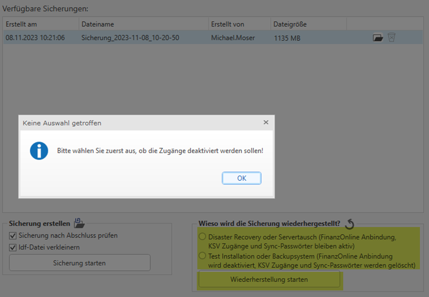

# RZL Daten wiederherstellen

Übernehmen Sie die zuvor gesicherten Dateien (.rzlbak und .rzlbak_hash)
und speichern Sie diese auf den Rechner (lokale
Installation)/Netzwerk/Server.

Öffnen Sie den RZL-Admin.

Klicken Sie auf den Menüpunkt *RZL Daten Sichern/Wiederherstellen*.

Wählen Sie unter Komplettsicherungspfad das Verzeichnis, in welchem Sie
die gesicherten Dateien gespeichert haben, aus.

Unter Verfügbare Sicherungen wird die Sicherung dargestellt.

Wählen Sie diese aus.

Wählen Sie aus wieso die Sicherung wiederhergestellt wird und klicken
Sie anschließend auf Wiederherstellung starten.

Es öffnet sich ein Dialogfenster.

Nachdem Sie mit Ja diese Meldung bestätigt haben, wird die Sicherung
wiederhergestellt.

Führen Sie die Lizenzierung der RZL – Programme aus ([Kapitel
2](#rzl-lizenzierung)).

!!! warning "Hinweis"
    Alle RZL – Programme müssen dabei beendet werden und können für die
    Dauer der Wiederherstellung nicht gestartet werden. (Ausnahme RZL-Admin).