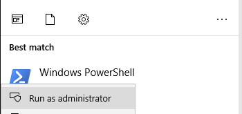
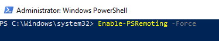
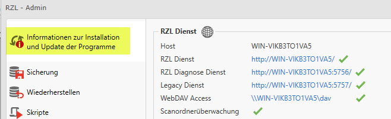
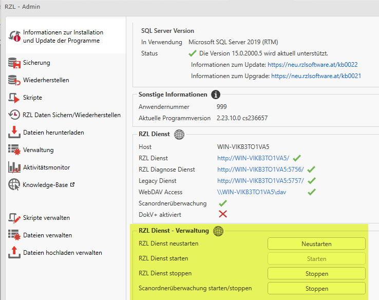
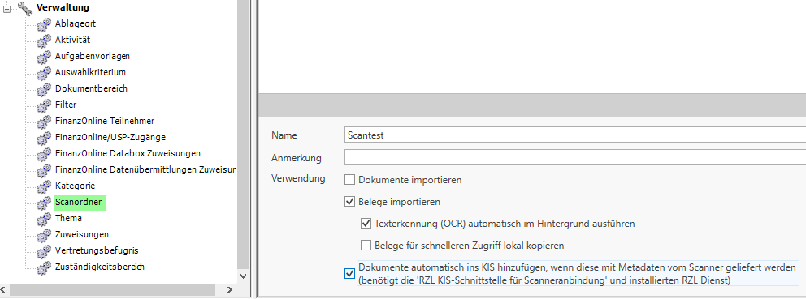
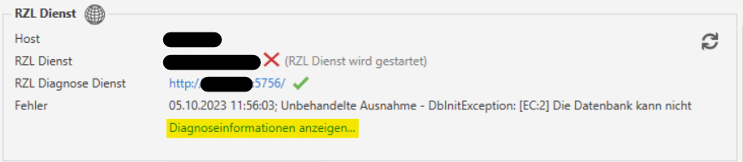
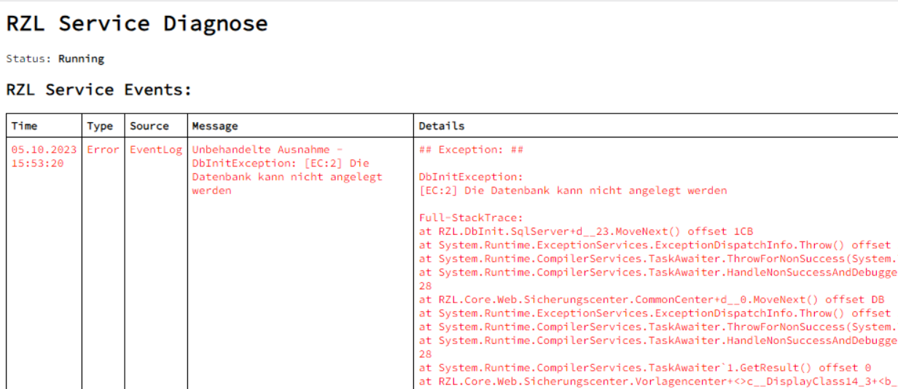

# RZL Dienst installieren

Dieses Kapitel richtet sich an System-Administratoren und beschreibt die
notwendigen Schritte, um den RZL Dienst einzurichten, der für folgende
kosten- und lizenzierungspflichtige Programme und Module vorausgesetzt wird:

- Programm RZL HON Next
- Programm RZL FIBU Next
- Modul RZL KIS-Schnittstelle für Scanner-Anbindung
- Modul RZL Dokumentenverwaltung Plus
- Modul Digitaler Personalakt
- Modul EBICS

!!! warning "Hinweis"
    Ab Programmversion 2.23.9.0 wird zwischen dem RZL Dienst und dem RZL Diagnose Dienst unterschieden.
    Die Aufgabe des RZL Diagnose Dienstes besteht darin, den Status des RZL Dienstes zu protokollieren.  

    Wie Sie die Protokolle abrufen können, entnehmen Sie bitte dem
    ([Kapitel 15.2)](#rzl-diagnose-dienst-event-log).  

    Es wird empfohlen, den RZL Dienst auf demselben Kanzlei-Server zu
    installieren, auf dem auch der Datenbankserver läuft.  

    Die Installation muss nur einmalig auf einem Gerät durchgeführt werden!  

    **Bitte achten Sie darauf, den Dienst <u>nicht</u> auf dem Exchange-Server
    zu installieren.**  
   
    RZL-Updates sollten immer zuerst auf dem Server (auf dem der RZL Dienst
    läuft) eingespielt werden. Sollte es hier Probleme geben, kann das Update
    noch komplett zurückgerollt werden, und die Programme laufen dann mit der
    ursprünglichen RZL-Version weiter. Wird das Update zuerst auf den Clients
    eingespielt und es treten anschließend Probleme beim Aktualisieren der
    Serverkomponente auf, führt dies zu einer beschädigten Netzwerkinstallation,
    da Clients und Server nicht zusammenpassen.

    Die Domänen-Administratorenrechte werden benötigt, damit automatisch ein
    Managed Service Account angelegt werden kann, unter dem der Dienst läuft.
    Zusätzlich muss auf dem Domänen-Controller PS Remoting aktiviert sein,
    damit das RZL Setup am Domänen-Controller den Service-Benutzer
    *rzlServiceMSA* anlegen kann.

    **Aktivieren von PS-Remoting:**

    Starten Sie auf dem Domänen-Controller die Windows PowerShell als
    Administrator.

    

    Führen Sie folgenden Befehl zum Aktivieren von PS Remoting aus:
    *Enable-PSRemoting –Force*

    

### Installation

Gehen Sie zur Installation bitte wie folgt vor:

1.  Starten Sie das RZL Setup als **Domänen-Administrator**. Sie finden dieses
    im Ordner **Setup** im **Daten-Repository**.
2.  Akzeptieren Sie die Lizenzbestimmungen und klicken Sie dann auf *Weiter*.
3.  Klicken Sie auf die Schaltfläche **Expertenmodus**.
4.  Gehen Sie auf **Weiter**.
5.  Stellen Sie sicher, dass in der Programmliste die Einträge
    **RZL Update-Service** und **RZL Dienst** ausgewählt sind.
6.  Klicken Sie abschließend auf **Aktionen durchführen**.

### Zugriffsrechte

Damit der RZL Dienst ordnungsgemäß funktioniert, benötigt der Account
`rzlServiceMSA\$` Zugriffsrechte auf das Daten-Repository und auf die
KIS-Datenbank. Die notwendigen Berechtigungen werden vom Setup automatisch
gesetzt, indem der Account `rzlServiceMSA\$` zur Benutzergruppe
**Domänen-Benutzer** hinzugefügt und Mitglied der Datenbank-Rolle **rzl_admin**
wird.

Der Dienstbenutzer benötigt folgende Rechte auf der Datenbank:

- Server-Rollen: `public` (als Mitglied der Benutzergruppe Domänen-Benutzer)  
- Datenbank-Rollen: `rzl_admin`

Die Rechte werden im Microsoft SQL Server Management Studio verwaltet.

### RZL Dienst Administration

Sobald der RZL Dienst erfolgreich installiert wurde, stehen Ihnen im
**RZL-Admin** zusätzliche Statusmeldungen und Einstellungen zur Verfügung.

Unter **Information zur Installation und Update der Programme** im Bereich
**RZL Dienst** werden Ihnen, abhängig von den lizenzierten Programmen und
Modulen, die Status der unterschiedlichen Features angezeigt.

Im Bereich **RZL Dienst - Verwaltung** können Sie den RZL Dienst neu starten,
die Logdateien zu Supportzwecken übermitteln und die Ordnerüberwachung
stoppen und starten.

## Zusätzliche, optionale Konfiguration

### KIS-Schnittstelle für Scanner-Anbindung

Über die angebundenen Scan-Lösungen der
[*RZL Scan-Partner*](https://rzlsoftware.at/partner/scan-partner)
und die lizenzierungspflichtige RZL KIS-Schnittstelle für Scanner-Anbindung
(kostenpflichtig) können Dokumente sowie Postein- und -ausgänge ins
RZL KIS übernommen werden.

!!! warning "Hinweis"  
    Ab der Programmversion 2.21.9 ist kein gesonderter KIS-Mitarbeiter für
    die Scanner-Anbindung mehr nötig. Ein bestehender KIS-Mitarbeiter wird
    beim Update automatisch in einen Servicemitarbeiter migriert und ist
    somit im *RZL Board* bzw. *KIS* **nicht** mehr sichtbar.

### Direkte Anbindung über Webservice

Standardmäßig können Verbindungen auf den Web Service nur innerhalb des
Servers hergestellt werden. Falls der Scanner nicht direkt am Server
angeschlossen ist, muss eine Firewall-Ausnahme erstellt werden.

Die Firewall-Regel sollte so gestaltet werden, dass der Zugriff nur vom
Scanner erfolgt (z. B. über eine `Nur Verbindungen durch folgende Computer-`
Regel oder IP-Beschränkung).

Falls Scans von einem mobilen Endgerät im Kanzlei-Netzwerk kommen, sollte am
DHCP-Server eine feste IP für das Gerät eingerichtet werden.

### Anbindung über Ordnerüberwachung

Damit Dokumente automatisch aus einem Scanordner ins KIS übernommen werden,
muss im KIS unter **Verwaltung → Scanordner** die entsprechende Option
aktiviert werden.  

Der Account `rzlServiceMSA\$` benötigt Lese-/Schreibrechte auf diesen Ordner.

## RZL Diagnose Dienst Event-Log

### Abrufen der RZL Diagnose Dienst Event-Logs

Falls der RZL Dienst nicht startet, sollten die Diagnoseprotokolle
überprüft werden.

1.  Öffnen Sie das Programm **RZL Admin**.
2.  Bleiben Sie im Reiter **Information zur Installation**.
3.  Unter **RZL Dienst** finden Sie alle Optionen.
4.  Klicken Sie auf **Diagnoseinformationen anzeigen…**.

    

5.  Es öffnet sich das Browserfenster **RZL Service Diagnose**.
    Im Event-Log können Sie herauslesen, ob und wann der Start des
    RZL Dienstes gescheitert ist. Zudem erhalten Sie eine detaillierte
    Beschreibung der Ursache.

    

6.  Bei Schwierigkeiten mit der Installation wenden Sie sich unter Angabe der erhaltenen Meldung
    an unseren Technik Support (**technik@rzl.at**)