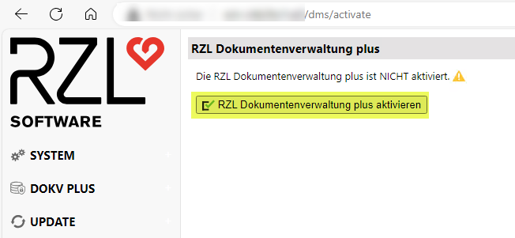
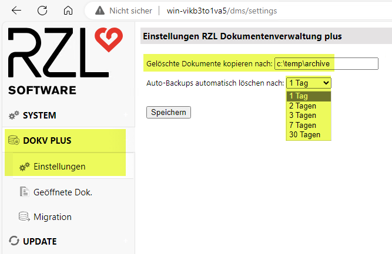
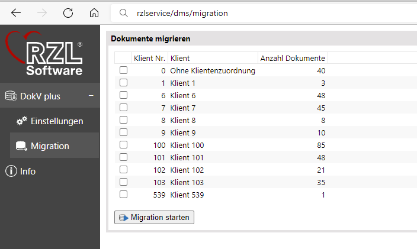
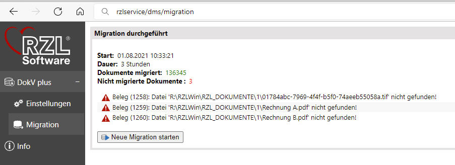
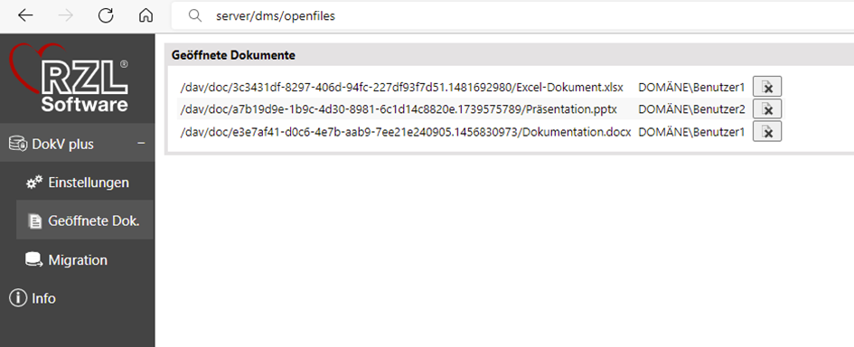

# Dokumentenverwaltung Plus einrichten

Damit Sie die kosten- und lizenzpflichtige Dokumentenverwaltung Plus
aktivieren können, muss der RZL Dienst installiert sein (siehe
[*RZL Dienst installieren*](/setup/dienst-installieren)), und einige zusätzliche
technische Voraussetzungen am Datenbankserver müssen erfüllt sein.
Um diese Voraussetzungen zu prüfen und eventuell fehlende Komponenten
bzw. Konfigurationen einzurichten, verwenden Sie bitte unseren
Einrichtungsassistenten (RZL Server Konfigurator). Nachdem Sie diesen
am Datenbankserver gestartet haben, folgen Sie bitte den Anweisungen
des Programms.

[*RZL Server Konfigurator herunterladen*](https://rzl.blob.core.windows.net/programme/RZL.Server.Configurator.zip)

Sollte der Server Konfigurator nicht funktionieren, können Sie
alternativ die Einrichtungen am Datenbankserver auch manuell vornehmen.
Hierfür gibt es eine Kurzanleitung. Sollten Sie diese benötigen, senden
Sie einfach eine Mail an [*technik@rzl.at*](mailto:technik@rzl.at).

## Aktivierung Dokumentenverwaltung Plus

Sobald alle technischen Voraussetzungen für den Betrieb der
Dokumentenverwaltung Plus erfüllt sind, kann die Dokumentenverwaltung
Plus aktiviert werden. Starten Sie dazu einen Web-Browser
(Microsoft Edge, Mozilla Firefox, Google Chrome, ...) und öffnen Sie die
Startseite des RZL Dienstes. (Sollten Sie die URL dafür noch nicht
kennen, können Sie sich diese im RZL Admin im Bereich
*Information zur Installation und Update der Programme* anzeigen lassen).
Wechseln Sie in den Bereich *DokV Plus*. Sollte dieser Eintrag bei Ihnen
nicht erscheinen, besitzen Sie noch keine Lizenz für dieses Modul.

Zur Aktivierung klicken Sie nun auf *RZL Dokumentenverwaltung Plus aktivieren*.

Sollten bestimmte technische Voraussetzungen noch nicht erfüllt sein,
wird Ihnen statt einer Erfolgsmeldung eine Liste der fehlenden
Komponenten bzw. Einstellungen angezeigt. Gehen Sie in diesem Fall die
obigen Punkte noch einmal durch und kontrollieren Sie alle Einstellungen
auf ihre Richtigkeit.

Im Bereich der Einstellungen können Sie spezielle Konfigurationen
vornehmen, die die Dokumentenverwaltung Plus betreffen.

Im Feld *Gelöschte Dokumente kopieren nach* können Sie ein
Archiv-Verzeichnis angeben, in das sämtliche aus der Dokumentenverwaltung
Plus gelöschten Dokumente gesichert werden sollen. Es muss sich dabei um
einen Pfad handeln, der vom RZL Dienst erreicht werden kann.

Sie können im KIS Vorgängerversionen von DokV+ Dokumenten
wiederherstellen. Eine genauere Beschreibung finden Sie im KIS Handbuch.

In den Einstellungen der Dokumentenverwaltung Plus kann der KIS-Admin
festlegen, wie lange solche Vorgängerversionen aufbewahrt werden sollen.
Sie können hierbei zwischen 1, 2, 3, 7 und 30 Tagen wählen.

!!! warning "Hinweis"
    Bitte beachten Sie, dass für die Vorgängerversionen zusätzlicher
    Speicherplatz benötigt wird. *(Originaldateigröße x Anzahl der Versionen)*

Nach Aktivierung der Dokumentenverwaltung Plus werden alle neuen
Dokumente (Belege, KIS-Dokumente, …) automatisch in der sicheren
Dokumentenverwaltung abgelegt. Diese Dokumente liegen dann nicht mehr
direkt im Dateisystem, sondern in der RZL-Datenbank, und der Zugriff
darauf ist nur noch über die RZL-Programme mit den beim Mitarbeiter
hinterlegten Rechten möglich.

Bestehende Dokumente, die bereits vorher durch RZL verwaltet wurden,
werden bei dieser Aktivierung **nicht automatisch übernommen**.
Hierzu ist eine Migration dieser Dokumente notwendig, die im nächsten
Punkt beschrieben wird.

## Migration bestehender Dokumente

Um Dokumente, die vor der Aktivierung der Dokumentenverwaltung Plus bereits
durch RZL verwaltet wurden, in das neue System zu übernehmen, öffnen Sie
einen Web-Browser (Microsoft Edge, Mozilla Firefox, Google Chrome, ...) und
rufen die Startseite des RZL Dienstes auf.

(Sollten Sie die URL dafür noch nicht kennen, können Sie sich diese im
RZL Admin im Bereich *Information zur Installation und Update der Programme*
anzeigen lassen).

Wechseln Sie in den Bereich *DokV Plus* und *Migration*.
Sollte dieser Eintrag bei Ihnen nicht erscheinen, besitzen Sie keine Lizenz
für dieses Modul.

Sie können nun die Klienten auswählen, von denen sämtliche Dokumente in die
Dokumentenverwaltung Plus übernommen werden sollen.

Starten Sie zunächst mit einem Klienten mit nur wenigen Dokumenten.
So können Sie schnell feststellen, ob es generelle Probleme beim
Migrationsprozess gibt.

Wenn alle Dokumente erfolgreich übernommen wurden, können Sie mit den
restlichen Klienten fortfahren.

Es empfiehlt sich, die Übernahme in mehreren Etappen durchzuführen,
idealerweise in der Nacht.

Der Migrationslauf kann, abhängig von der Datenmenge, mehrere Stunden dauern
und benötigt Ressourcen, die den normalen Tagesbetrieb verlangsamen können.

!!! warning "Hinweis"
    **ACHTUNG!**  
    Beachten Sie bitte, dass beim Migrationslauf die Dokumente
    vom Daten-Repository-Ordner `RZL_DOKUMENTE` in die SQL-Datenbank
    **verschoben** werden. Daher muss am Datenbankserver **ausreichend freier Speicherplatz**
    vorhanden sein. 👉 Zur Abschätzung des benötigten Speicherplatzes sehen Sie sich
    einfach die **Größe des Ordners** `RZL_DOKUMENTE` an. Nach der Migration sind die Dokumente
    **nicht mehr** im `RZL_DOKUMENTE`-Ordner verfügbar. Eventuelle
    **Links von externen Programmen werden dadurch ungültig!**

Am Ende der Migration erscheint eine Zusammenfassung des Migrationslaufs
und eine Liste aller Dokumente, die nicht übernommen werden konnten:

Gehen Sie die Liste der nicht übernommenen Dokumente durch und versuchen Sie,
anhand der Fehlermeldung die Probleme zu beheben.  

Ein häufiger Problemfall ist das **Fehlen der entsprechenden Dokument-Datei**.
Da die Dokument-Dateien vor der Dokumentenverwaltung Plus direkt im Dateisystem
zugreifbar waren, konnten sie möglicherweise versehentlich verschoben, gelöscht
oder umbenannt werden. In diesem Fall müssen Sie sicherstellen, dass die
entsprechenden Dateien wieder an ihren ursprünglichen Speicherort gelangen
(der entsprechende Dateipfad wird in der Fehlermeldung angegeben). Eventuell ist
es notwendig, die entsprechenden Dateien von einem Sicherungsmedium wiederherzustellen.

Danach können Sie die Migration erneut starten, und die Dokumente werden in
die Dokumentenverwaltung Plus übernommen.

### Bereinigung nicht migrierter Dokumente

Es kommt hierbei darauf an, ob es sich um ein KIS-Dokument,  
einen gebuchten/ungebuchten Beleg oder ein nicht versendetes Dokument handelt.

- **KIS-Dokument:**
    KIS starten, das entsprechende Dokument suchen
    (Klientnummer und Dateiname werden beim Migrationsfehler ausgegeben),
    löschen und anschließend auch aus dem KIS-Papierkorb entfernen.

- **Ungebuchte Belege:**
    Board starten, den entsprechenden Beleg suchen,
    löschen und anschließend auch aus dem Beleg-Papierkorb entfernen.

- **Gebuchter Beleg:**
    Board starten, den entsprechenden Beleg suchen und feststellen,
    wie dieser gebucht wurde. Anschließend den entsprechenden FIBU-Klienten öffnen
    und den Beleg beim zugehörigen Buchungssatz entfernen.
    Danach sollte der Beleg ungebucht sein, und man kann wie bei einem
    ungebuchten Beleg vorgehen.

- **Nicht versendetes Dokument:**
    Wenn im Outlook ein Postausgang im KIS angelegt wird,
    werden beim Erstellen der E-Mail die Metadaten des Dokuments
    im KIS gespeichert. Erst beim Versenden wird die entsprechende
    MSG-Datei hinzugefügt.  

    Falls diese E-Mail nicht verschickt wurde (oder KIS aufgrund
    technischer Probleme nicht registriert hat, dass sie versendet wurde),
    entsteht das Problem, dass zwar ein Dokument vorhanden ist,
    jedoch keine zugehörige Dokument-Datei existiert.

    In diesem Fall kann es helfen, die Datei über Outlook nachtragen zu lassen.
    Dafür gibt es eine spezielle Funktion in den RZL Outlook-Add-ins.
    Diese muss von dem Benutzer ausgeführt werden, der das Dokument
    ursprünglich verschickt hat. Wer dies war, lässt sich in den
    Dokument-Infos im KIS im Feld *Importiert von* einsehen.

    Dieser Vorgang ist im KIS-Handbuch unter Abschnitt **12.1.1** beschrieben.

- **Man kann es unverändert belassen.**

## Geöffnete Dokumente

In dieser Ansicht werden alle aktuell geöffneten und
für die Bearbeitung durch andere Benutzer gesperrten Dokumente angezeigt.
RZL-Administratoren können hier ermitteln, welche Benutzer
den Zugriff auf bestimmte Dokumente sperren,
und diese Sperren notfalls manuell durch Klick auf

aufheben.

Dies ist erforderlich, wenn dringend Zugriff auf ein Dokument benötigt wird,
der aktuelle Bearbeiter des Dokuments aber nicht erreichbar ist (z. B. wegen Urlaub).
Weiters kann es vorkommen, dass durch einen Fehler oder einen Absturz der Anwendung,
mit der das Dokument bearbeitet wurde, die Sperre nicht mehr korrekt freigegeben wird.
Auch in dieser Situation ist es notwendig, die Sperre explizit durch einen
RZL-Administrator aufzuheben.

!!! warning "Hinweis"
    Bitte beachten Sie, dass die explizite Aufhebung einer Sperre dazu
    führen kann, dass der betroffene Benutzer das aktuell bearbeitete
    Dokument nicht mehr speichern kann und somit seine Änderungen an
    diesem Dokument verloren gehen.