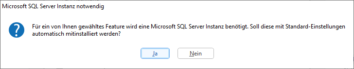
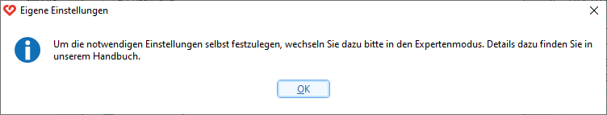

# Installation ändern/hinzufügen/entfernen

Bei diesem Vorgang können Sie Programme hinzufügen (z. B. bei
Nachbestellung von RZL-Programmen) oder entfernen.

1.  Öffnen Sie die Systemsteuerung.
2.  Klicken Sie auf *Programm deinstallieren*.
3.  Wählen Sie den Eintrag *RZL – Lösungen fürs Rechnungswesen* und
    klicken Sie auf *Ändern*.
4.  Wählen Sie im RZL-Setup die Option *Ändern*.
5.  Wählen Sie die gewünschten RZL-Programme bzw. zusätzlichen
    Komponenten aus, die Sie hinzufügen oder entfernen möchten, und
    bestätigen Sie mit *Aktion durchführen*.
6.  Beenden Sie das RZL-Setup mit *Fertigstellen*.

!!! warning "Hinweis"
    Beachten Sie bei der Nachinstallation der Programme RZL KIS/Board und
    Firmen-Board mit Basis-Modul, dass diese Programme den Einsatz einer
    Microsoft SQL-Server-Datenbank und eventuell auch den RZL-Dienst
    erfordern. Es empfiehlt sich daher, diese Programme mit Hilfe des
    [Expertenmodus](/setup/installation#expertenmodus-zb-fur-netzwerkinstallation)
    zu installieren.

## Umstieg von Fibu Klassik auf Fibu Next

1.  Öffnen Sie die Systemsteuerung.
2.  Klicken Sie auf *Programme und Features*.
3.  Wählen Sie den Eintrag *RZL – Lösungen fürs Rechnungswesen* und
    klicken Sie auf *Ändern*.
4.  Wählen Sie im RZL-Setup die Option *Ändern*.
5.  Wählen Sie nun *Kanzlei-Informations-System / Board* oder
    *Firmen-Board mit Basis-Modul*.

6.  Bestätigen Sie mit *Weiter*.

Anschließend erscheint folgende Meldung:

Wenn Sie auf *Ja* klicken, können Sie die Installation mit Ihrer
Anwendernummer fortsetzen. Falls Sie *Nein* wählen, erscheint dieser
Hinweis:

Bestätigen Sie mit *OK*, bleiben Sie auf der vorherigen Maske.
Um in den Expertenmodus zu wechseln, klicken Sie auf *Zurück* und wählen
dann den Expertenmodus aus.