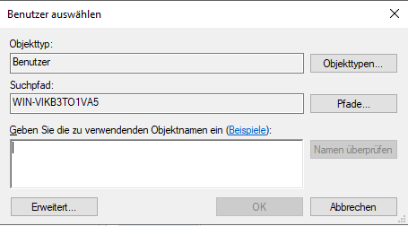

# Installation Firmen-Board mit Basis Modul (Belege, FIBU Next)

Diese Beschreibung enthält Anleitungen zur Installation der
Datenbank und der RZL Belegverarbeitung sowie Schritte zur
Installation/Konfiguration der RZL Programme.

Für die folgenden Schritte sind Administrator-Rechte erforderlich.
Bitte beachten Sie dass alle Schritte für eine vollständige Installation notwendig sind.

!!! warning "Hinweis"
    Bitte beachten Sie vor der Installation die Systemvoraussetzungen
    laut RZL Technischem Blatt für das RZL Firmen-Board mit Basis Modul.
    Nähere Details finden Sie online unter:
    [*https://rzlsoftware.at/Lizenzbestimmungen*](https://rzlsoftware.at/Lizenzbestimmungen)

## Installation

Für eine lokale Einzelplatz Installation folgen Sie bitte der Anleitung:
[*Neue Einzelplatz Installation*](/setup/installation#neue-einzelplatz-installation).

Für eine Netzwerkinstallation folgen Sie der Anleitung
[*Expertenmodus (Netzwerkinstallation)*](/setup/installation#expertenmodus-zb-fur-netzwerkinstallation).

## RZL Programmlizenzierung

Lizenzieren Sie das Programm gemäß der Anleitung:
[*RZL Lizenzierung*](/setup/lizenzierung).

## ZMV-Datenbank anlegen

Nach der Lizenzierung startet automatisch der *ZMV Assistent*.
Lassen Sie die ZMV-Datenbank automatisch anlegen.

## RZL Datenübernahme

Falls eine Datensicherung vorhanden ist, übernehmen Sie diese
jetzt ([siehe *RZL Daten wiederherstellen*](/setup/daten-wiederherstellen)).
Bei einer Neuinstallation können Sie diesen Punkt überspringen.

## ZMV Daten in die Datenbank übernehmen

Falls keine RZL Daten vorhanden sind, kann dieser Punkt
übersprungen werden.

1.  Wählen Sie in der Zentralen Mandantenverwaltung
    *ZMV → Optionen → Datenübernahme aus ZMV-Datei…*

    

2.  Falls keine ZMV-Datei Sicherung existiert, wählen Sie
    *Datei sichern…* und erstellen Sie eine Sicherung.

3.  Wählen Sie *ZMV-Datei gesichert* und starten Sie
    die Übernahme mit *Durchführen*.

    

## Sicherung der RZL Datenbank erstellen

Starten Sie den *RZL-Admin* und wählen Sie
*Datensicherung erstellen*.

!!! warning "Hinweis"
    Beachten Sie bitte die Erfolgs- oder Fehlermeldung nach der
    Datensicherung!

## Mitarbeiter anlegen

Beim ersten Start müssen Mitarbeiterdaten angelegt werden.
Diese befinden sich im *RZL Board*. Die Verwaltung erfolgt
analog zu den Klientenstammdaten. Mindestens ein Mitarbeiter
soll als *RZL Administrator* im *KIS* hinterlegt werden.

1.  Starten Sie das *RZL Board* über das *Startmenü*.
2.  Klicken Sie auf *Neuer Mitarbeiter*.

    

3.  Wählen Sie eine freie Nummer für den neuen Mitarbeiter.
4.  Falls die Person noch nicht existiert, kann sie über
    das grüne *Plus* neu angelegt werden.
5.  Tragen Sie das *Eintritts- und Austrittsdatum* ein.
6.  Geben Sie den *Benutzernamen* für die Windows-Zuordnung ein.

    

7.  Klicken Sie auf *Speichern*.
8.  Hinterlegen Sie im *KIS* die *Mitarbeiterrechte* und
    *Benutzerrechte* über das Icon *Zu den KIS Mitarbeiterstammdaten*.

## Installation abschließen

1.  Starten Sie ein klassisches *RZL Programm*
    (z. B. Finanzbuchhaltung, Lohnverrechnung).
    Prüfen Sie, ob die Klienten-Stammdaten verfügbar sind.
    Kontrollieren Sie, ob rechts unten am Bildschirm *BOARD: Ja* steht.

2.  Starten Sie das *RZL Board*. (Bei Neuinstallation überspringen)
3.  Wählen Sie *Stamm* → *ZMV Klienten-Übernahme*.

Falls Klienten angezeigt werden, war die Datenübernahme erfolgreich!
Falls **keine Klienten** angezeigt werden, führen Sie den Punkt
[*ZMV Daten in die Datenbank übernehmen*](#zmv-daten-in-die-datenbank-ubernehmen) erneut durch!
