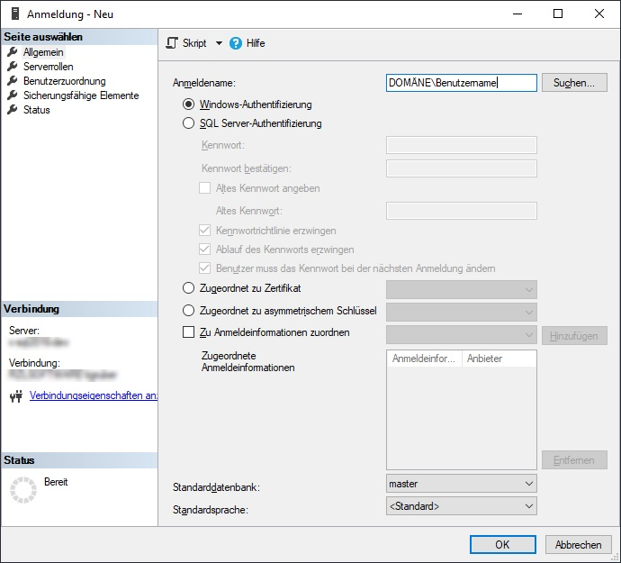

# Installation RZL Kanzlei-Informations-System (KIS)/Board (FIBU Next, HON Next)

Diese Beschreibung ist für *Techniker & Systemadministratoren* gedacht. Sie
enthält Anleitungen für die Installation des Datenbank-Servers und der
RZL-Programme am Kanzlei-Server sowie einzelne Anleitungsschritte für die
Installation bzw. Konfiguration der RZL-Programme auf den Arbeitsplatz-PCs.

Alle angeführten Schritte sind für eine vollständige Installation notwendig.

Alle Schritte der Installation müssen mit *demselben Domänen-Benutzer*
durchgeführt werden! Wir empfehlen daher die Verwendung des
*Domänen-Administrators*.

Für die Dauer der Installation und Umstellung kann bei einer bestehenden
RZL-Installation mit den anderen RZL-Programmen (FIBU, LOHN, ...) nicht
gearbeitet werden!

!!! warning "Hinweis"
    Bitte beachten Sie vor der Installation die Systemvoraussetzungen laut
    RZL-Technischem Blatt für KIS. Nähere Details finden Sie online
    unter: [*https://rzlsoftware.at/Lizenzbestimmungen*](https://rzlsoftware.at/Lizenzbestimmungen)

Die Einrichtung der erforderlichen Microsoft-SQL-Datenbank bzw. die RZL
KIS-Installation ist durch den zuständigen *Netzwerkbetreuer* der
Kanzlei vorzunehmen.

## Datenbankserver installieren

Gehen Sie wie in Kapitel [*Expertenmodus*](/setup/installation#expertenmodus-zb-fur-netzwerkinstallation)
beschrieben vor.

## Konfigurieren der Datenbank

1.  Starten Sie das Programm RZL Zentrale Mandantenverwaltung.
    1.  Bei einer bestehenden RZL-Installation: Klicken Sie auf
        *ZMV → Neu anlegen*.  
        Die vorgeschlagenen Werte belassen Sie bitte und bestätigen mit
        *Anlegen bestätigen*.

    2.  *Bei einer Neuinstallation:* Fahren Sie mit dem ZMV-Assistenten fort
        und lassen Sie die ZMV-Datenbank automatisch anlegen.

## ZMV-Daten in die Datenbank übernehmen

Im Falle einer Neuinstallation können Sie diesen Punkt überspringen.

1.  Klicken Sie in der Zentralen Mandantenverwaltung (ZMV) auf
    *ZMV → Optionen → Datenübernahme aus ZMV-Datei...*.

    

2.  Wenn Sie keine ZMV-Dateisicherung besitzen, wählen Sie *Datei
    sichern…* und legen eine Sicherung der ZMV-Datei an.

3.  Wählen Sie *ZMV-Datei gesichert* und beginnen Sie die Übernahme mit
    *Durchführen*.

    

## Sicherung der RZL-Datenbank erstellen

Starten Sie den RZL-Admin und klicken Sie auf *Datensicherung erstellen*.

!!! warning "Hinweis"
    Beachten Sie bitte die nach Anwahl der Schaltfläche
    *Datensicherung erstellen* aufscheinende **Erfolgs-** oder
    **Fehlermeldung!**

### RZL-Administrator anlegen

Beim erstmaligen Start von KIS bzw. des RZL Boards werden Sie vom System
aufgefordert, einen *RZL-Administrator* anzulegen. Ein RZL-Administrator
(= Mitarbeiter mit KIS-Administratorrechten) sollte jener Mitarbeiter
werden, welcher dann weitere Personen im KIS anlegen darf.

Gehen Sie dazu bitte folgendermaßen vor:

1.  Melden Sie sich auf einem beliebigen Arbeitsplatzrechner mit dem
    Windows-Benutzerzugang an. Dieser Benutzer wird im weiteren Verlauf
    eine *RZL-Administrator-Berechtigung* erhalten.

2.  Starten Sie das *RZL Board*.

3.  Geben Sie im Feld *Nummer* die *Mitarbeiternummer* ein und
    bestätigen Sie mit *Speichern* (bei Verwendung des RZL
    Honorarverrechnungsprogramms verwenden Sie die *Mitarbeiternummer*).

Dieser Mitarbeiter ist nun berechtigt, weitere Benutzer im RZL Board
anzulegen.

### Weitere RZL-Administratoren anlegen

1.  Starten Sie das RZL Board mit einem *RZL-Administrator*.

2.  Klicken Sie im Bereich *Kanzlei* auf *Stamm* und wählen Sie unter
    *Personen/Klientenverwaltung* den Mitarbeiter aus.

3.  Klicken Sie rechts unten auf *+ Neuer Mitarbeiter*. Es öffnet sich
    ein neuer Reiter.

4.  Geben Sie im Feld *Nummer* die *Mitarbeiternummer* (welche Sie
    bereits im RZL Honorarverrechnungsprogramm nutzen) ein.

5.  Im Feld *Person* tragen Sie den Nachnamen und Vornamen des
    Mitarbeiters ein.

6.  Es öffnet sich anschließend ein Dropdown-Menü. Klicken Sie hier auf
    *... als neue Person anlegen*.

7.  Im neuen Fenster *Neue Person* klicken Sie anschließend auf
    *Speichern* (weitere Daten können optional nachträglich hinzugefügt
    werden) und schließen Sie das Fenster.

8.  Tragen Sie nun unter *Benutzername* den *Windows-Benutzernamen* des
    angelegten Mitarbeiters ein und klicken Sie auf *Speichern*.

9.  Anschließend klicken Sie auf *zu den KIS-Mitarbeiterstammdaten*. Es
    öffnet sich das RZL Kanzlei-Informations-System (KIS).

10.  Im Bereich *Benutzerrechte* wählen Sie *RZL-Administrator* aus.

Der erstellte Benutzer verfügt nun über das Recht *RZL-Administrator*.

## Datei-Indizierung im Betriebssystem aktivieren

Die Datei-Indizierung wird benötigt:

- für die *Volltextsuche in Dokumenten* im *RZL Kanzlei-Informations-System*
- für das Aktualisieren des Datei-Änderungsdatums bei KIS-Dokumenten

Im RZL Kanzlei-Informations-System kann bei der *Filterfunktion* (in der
Dokumentenverwaltung) ein *Volltextfilter* verwendet werden.

Dieser Filter durchsucht alle indizierten Dokumente nach einem
einzugebenden Text. Voraussetzung dafür ist, dass die *Indizierung der
Dateien im Betriebssystem* aktiviert ist.

Ob die erforderliche Indizierung aktiv ist, prüfen Sie in KIS unter
*Extras → Einstellungen → Dokumentenverwaltung*. Hier können Sie sehen,
ob der Dokumente-Ordner indiziert ist.

Falls die Indizierung nicht aktiv ist, folgen Sie den Schritten für
Windows Server 2016/2019/2022 zur Aktivierung der Windows Search
Dienste und IFilter.

### Schritt 1 bei Microsoft Server 2016/2019/2022:

1.  Öffnen Sie den *Server-Manager* und navigieren Sie zu
    *Verwalten → Rollen und Features hinzufügen*.

2.  Aktivieren Sie unter *Features* die Option *Windows Search*.

3.  Bestätigen Sie mit *Weiter* und *Installieren*.
    Falls erforderlich, starten Sie den Server neu.

### Schritt 2 für Microsoft Server 2016/2019/2022:

Falls *Microsoft Office Filter* für Office-Dateien nicht aktiv sind:

1.  Installieren Sie das *Microsoft Office 2010 Filter Pack*:  
    [Microsoft Office 2010 Filter Packs](https://www.microsoft.com/de-at/download/details.aspx?id=17062)

2.  Installieren Sie das *Service Pack 2* für das Filter Pack (64-bit):  
    [KB2687447](https://www.microsoft.com/de-de/download/details.aspx?id=39668)

## Installation abschließen

1.  *Ein klassisches RZL Programm starten* (z. B.: Finanzbuchhaltung, Lohnverrechnung, ...).
    Überprüfen Sie, ob auf Klienten-Stammdaten zugegriffen werden kann und
    ob rechts unten am Bildschirm *BOARD: Ja* steht.

2.  *RZL Board starten* (im Falle einer Neuinstallation überspringen Sie diesen Punkt).  
    Wählen Sie links unten *STAMM* aus und anschließend *ZMV Klienten-Übernahme*.
    Wenn in dieser Übersicht Klienten angezeigt werden, wurde die Datenübernahme erfolgreich durchgeführt.
    Falls *keine Klienten* angezeigt werden, führen Sie bitte *Punkt 1.6 ZMV Daten in die Datenbank übernehmen* erneut durch!

## Zusätzliche Konfigurationen (optional)

### Weitere Benutzer berechtigen, ein RZL Update durchzuführen

Um ein Update auf eine neue Programmversion durchzuführen,
muss ein Benutzer *zusätzliche Rechte auf der Datenbank* besitzen.

1.  Starten Sie das *SQL Server Management Studio* auf dem
    Datenbankserver und verbinden Sie sich mit der *SQLEXPRESS_RZL Instanz*.

2.  Navigieren Sie zum Ordner *Sicherheit → Anmeldungen* und legen
    Sie eine neue Anmeldung für den betroffenen Windows-Benutzer bzw.
    die betroffene Benutzergruppe an.

    
    

3.  Wechseln Sie auf die Seite *Serverrollen* und aktivieren Sie das Kästchen
    bei den Serverrollen *public* und *rzl_server_admin*.

4.  Schließen Sie den Dialog mit der *OK*-Schaltfläche.

5.  Selektieren Sie die Datenbank *RZLZMV_[Anwendernummer]* und
    navigieren Sie zum Ordner *Sicherheit → Benutzer*. Dort wählen Sie aus
    dem Kontextmenü die Option *Neuer Benutzer...* aus.

    

6.  Wählen Sie unter *Benutzertyp* *Windows-Benutzer*, vergeben Sie einen  
    Benutzernamen und tragen Sie den zuvor angelegten Anmeldenamen ein.

    

7.  Unter dem Punkt *Mitgliedschaft in Datenbankrollen* wählen Sie *rzl_admin*.
   
    