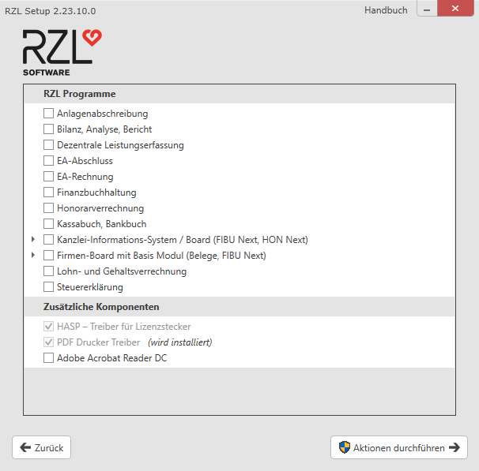
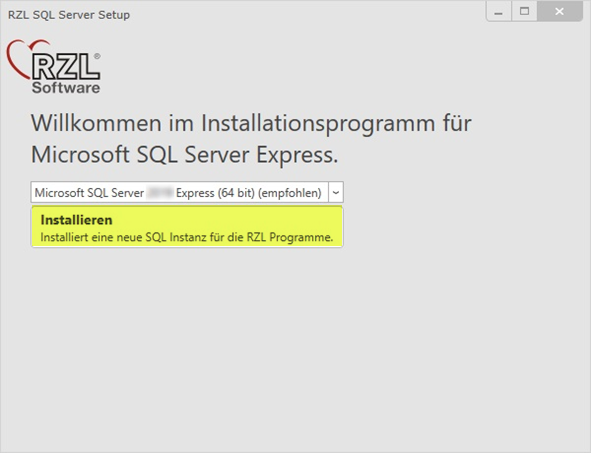

# Installation

## Wichtige allgemeine Informationen

Die RZL-Programme sind nur für den Betrieb in typischen Microsoft  
Windows-Umgebungen ausgelegt.

Dieses Dokument beschreibt die Installation der RZL-Programme in diesen  
Umgebungen.

!!! warning "Hinweis"
    Bitte beachten Sie vor der Installation die Systemvoraussetzungen.
    Nähere Details finden Sie in den **RZL *Technischen Blättern***, online
    aufrufbar unter: [*https://rzlsoftware.at/Lizenzbestimmungen*](https://rzlsoftware.at/Lizenzbestimmungen)

Die RZL-Programme werden immer lokal auf den Arbeitsplätzen installiert.
Die Daten (RZL-Daten-Repository und RZL-Datenbank) können ebenfalls
lokal eingerichtet werden (Einzelplatzinstallation), sind dann aber auch
nur für diesen Arbeitsplatz zugänglich. Ist ein Zugriff durch mehrere
Arbeitsplätze gewünscht (Netzwerkinstallation), müssen die Daten
zentral auf einem Server eingerichtet werden.

Das RZL *Daten-Repository* ist ein Verzeichnis, das von jedem
RZL-Programm benötigt wird. Es enthält unter anderem *Klientendaten*,
*Einstellungen*, *Protokolle* und *Setups*.

Die RZL-Datenbank ist ein Microsoft SQL-Server, der nur von bestimmten
RZL-Programmen benötigt wird.

Technische Hilfestellungen finden Sie online auf der RZL-Webseite unter
[*rzlsoftware.at/kb*](https://rzlsoftware.at/kb).

Auf der RZL-Webseite [*rzlsoftware.at*](https://rzlsoftware.at) finden
Sie im Anwenderbereich unter dem Bereich *Technik Knowledge Base/Downloads* stets die neuesten
**Programmaktualisierungen (Updates)** zum Download.

Die jeweils aktuelle **Vollversion** der RZL-Programme (für
Neuinstallationen usw.) kann im **Anwenderbereich** der RZL-Webseite
(Registrierung und Login erforderlich) ebenfalls im Bereich *Technik
Knowledge Base/Downloads* unter *„RZL Komplettversion“* heruntergeladen
werden.

Die Zugangsdaten für den Anwenderbereich der RZL-Webseite finden Sie
normalerweise in den Ihnen im Zuge der Programmauslieferung
übermittelten Unterlagen. Falls Ihnen diese Zugangsdaten nicht mehr
bekannt sind, fordern Sie diese bitte – unter Angabe Ihrer RZL
Anwendernummer – per E-Mail unter *<software@rzl.at>* an.

## Neue Einzelplatz-Installation 

Bei einer *neuen Einzelplatz-Installation* werden sämtliche Komponenten
lokal installiert, und die Verwendung der RZL-Programme ist
ausschließlich auf dem aktuellen Gerät möglich. Ist es notwendig,
von unterschiedlichen Geräten im Netzwerk auf denselben Datenbestand
zuzugreifen, wählen Sie bitte eine andere Installationsvariante
([*Expertenmodus*](#expertenmodus-zb-fur-netzwerkinstallation)).

1.  Zum Starten der Installation führen Sie die Datei *RZL Setup.exe* aus.

2.  Bestätigen Sie die Lizenzbestimmungen und klicken Sie auf *Weiter*.
    

3.  Klicken Sie auf *Neue Einzelplatz-Installation*.
    

4.   Wählen Sie **nur die RZL-Programme** aus, die Sie lizenziert haben, sowie die
    gewünschten zusätzlichen Komponenten. Bestätigen Sie anschließend mit
    *Aktion durchführen* bzw. *Weiter*. 
    
    
    Für die Programme *Kanzlei-Informations-System*, *RZL Board* und
    *Firmen-Board mit Basismodul* ist eine Datenbank (Microsoft SQL-Server)
    erforderlich. Wenn Sie eines dieser Programme ausgewählt haben,
    wird im Zuge einer Einzelplatzinstallation automatisch auch diese
    Datenbank installiert. Die dafür notwendigen Eingaben müssen in der
    nachfolgenden zusätzlichen Einstellungsseite (4a) ergänzt werden.
    Bitte beachten Sie hierzu [*Installation KIS/Board*](/setup/installation-kis-board) und [*Installation Firmen-Board mit Basis Modul*](/setup/installation-firmenboard).
   
    1.  Geben Sie in der zusätzlichen Einstellungsseite Ihre Anwendernummer ein.
        Falls der RZL-Dienst ebenfalls lokal installiert werden soll, können Sie
        dies hier anhaken (wird aktuell für die Module *RZL HON Next*,
        *RZL FIBU Next*, *RZL KIS-Schnittstelle für Scanner-Anbindung*,
        *RZL Dokumentenverwaltung Plus*, *Digitaler Personalakt* und *EBICS* benötigt).

        **Wählen Sie den RZL-Dienst nicht aus, wenn Sie keines der oben genannten Module verwenden.**
        

        Klicken Sie auf *Aktionen durchführen*.
      
5.  Nach erfolgreicher Installation können Sie das Installationsfenster
    mit *Fertigstellen* schließen.

6.  Anschließend können Sie die RZL-Programme starten. Beim ersten Start
    werden Sie aufgefordert, die [*Lizenzierung*](/setup/lizenzierung)
    dieser Installation durchzuführen.

## Netzwerkarbeitsplatz einrichten

!!! warning "Hinweis"
    Bei der Einrichtung der Netzwerkarbeitsplätze können Sie im
    Expertenmodus einzelne Programme abwählen, die auf dem jeweiligen Gerät
    nicht benötigt werden.

Ein Netzwerkarbeitsplatz kann nur eingerichtet werden, wenn im Netzwerk
bereits ein Daten-Repository verfügbar ist. Ist dies nicht der Fall,
wechseln Sie bitte in den [*Expertenmodus*](#expertenmodus-zb-fur-netzwerkinstallation)
und richten Sie zunächst ein Daten-Repository bzw. eine Serverinstallation ein.

Zum Starten der Installation führen Sie die Datei *RZL Setup.exe* aus
dem Daten-Repository aus.

1.  Klicken Sie auf *Netzwerkarbeitsplatz einrichten*.
    

2.  Wählen Sie im nächsten Fenster Ihr vorhandenes Daten-Repository aus.
    

3.  Sobald Sie ein gültiges Daten-Repository ausgewählt haben, ändert
    sich der Status auf *Gültig* (), und Sie können die
    Installation mit *Aktion durchführen* beginnen.

## Expertenmodus (z.B. für Netzwerkinstallation)

Der *Expertenmodus* kann für komplexere Installationsvarianten verwendet
werden. Er bietet erweiterte Einstellungsmöglichkeiten und wurde für
Systembetreuer oder Personen mit guten IT-Kenntnissen konzipiert.

!!! warning "Hinweis"
    Im Expertenmodus können sowohl der Pfad des lokalen
    Programmverzeichnisses als auch das Verzeichnis des
    Daten-Repositories geändert werden.

Zum Starten des Expertenmodus führen Sie die Datei *RZL Setup.exe* aus
und wählen die Option *Expertenmodus*. 

1.  Im nächsten Fenster können Sie folgende Einstellungen anpassen:
      
    Unter *Lokales Programmverzeichnis* können Sie über das
    *Ordner-Symbol* ein Installationsverzeichnis auswählen, in das die
    RZL-Programme installiert werden sollen. Verwenden Sie hier bitte
    immer ein lokales Laufwerk, da die Ausführung von Programmen über
    ein Netzwerk Probleme verursachen kann.  
    

2.  Unter *Daten-Repository* können Sie durch Anklicken von *Auswählen*
    ein bereits bestehendes Daten-Repository auswählen.

3.  Durch anschließendes Klicken auf das *Ordner-Symbol* müssen Sie ein
    vorhandenes Daten-Repository auswählen.  
    

4.  Sobald sich der Status auf *Gültig* () ändert, können Sie mit
    *Weiter* die Installation fortsetzen.

5.  Unter *Daten-Repository* können Sie durch Anklicken von *Neu anlegen*
    ein neues Daten-Repository erstellen. Wählen Sie hier ein lokales
    Verzeichnis, wenn nur der aktuelle Arbeitsplatz auf das
    Daten-Repository zugreift. Ist der Zugriff von mehreren
    Arbeitsplätzen gewünscht, wählen Sie eine Netzwerkfreigabe bzw.
    ein Netzlaufwerk aus.  
    

6.  Durch die Auswahl von *Kombi-Arbeitsplatz* haben Sie die Möglichkeit,
    ein lokales Offline-Daten-Repository anzugeben. Diese Einstellung ist
    nur sinnvoll, wenn das reguläre Daten-Repository ein Netzwerkverzeichnis
    ist.  
    

7.  Ein *Kombi-Arbeitsplatz* ermöglicht Ihnen, bestimmte Daten in das
    Offline-Daten-Repository zu verschieben. Der Zugriff auf diese Daten
    ist dann auch möglich, wenn das Gerät nicht mit dem Netzwerk verbunden
    ist. Genaue Details zum verschieben von Programmklienten entnehmen Sie
    bitte dem [*ZMV-Handbuch*](https://rzlsoftware.at/fileadmin/user_upload/PDF_Handbuecher/ZMV.pdf).

8.  Mit einem Klick auf *Weiter* gelangen Sie zum nächsten Fenster mit
    weiteren Einstellungen.

9.  Im nächsten Fenster können Sie auswählen, welche Programme bzw.
    Komponenten im Detail installiert werden sollen.

    !!! warning "Hinweis"
        Die vorausgewählten RZL-Programme werden aus dem vorhandenen
        Daten-Repository ausgelesen. Falls bestimmte Programme auf dem
        jeweiligen Gerät nicht benötigt werden oder zusätzliche Programme
        installiert werden sollen, entfernen oder setzen Sie das Häkchen beim
        jeweiligen RZL-Programm.

        Für die Programme *Kanzlei-Informations-System*, *RZL Board* und
        *Firmen-Board mit Basismodul* ist eine Datenbank (Microsoft SQL-Server)
        erforderlich. Falls Sie eines dieser Programme ausgewählt haben, gelangen
        Sie beim Klick auf *Weiter* zu einer zusätzlichen Einstellungsseite (9a),
        in der Sie Datenbankeinstellungen vornehmen können. Bitte beachten Sie
        hierzu [*Installation KIS/Board*](/setup/installation-kis-board) und [*Installation Firmen-Board mit Basis Modul*](/setup/installation-firmenboard).

    Abhängig von den eingesetzten Programmfunktionen kann es erforderlich sein,
    den *RZL-Dienst* zu installieren. Dieser kann im Bereich *Zusätzliche
    Komponenten* ausgewählt werden. Bitte beachten Sie hierzu [*RZL Dienst installieren*](/setup/dienst-installieren).

    Klicken Sie auf *Weiter* bzw. *Aktionen durchführen*, um mit dem
    Installationsvorgang fortzufahren.  

    1.  Abhängig von den ausgewählten Programmen wird Ihnen ein zusätzliches
        Einstellungsfenster für die Konfiguration der Datenbank angezeigt.

        Geben Sie hier Ihre Anwendernummer und die zu verwendende
        Datenbankinstanz an.

        Falls noch keine entsprechende Datenbankinstanz eingerichtet wurde,
        können Sie durch einen Klick auf *Neue lokale SQL-Server-Instanz
        installieren* unser SQL-Server-Setup starten.

        

        Es handelt sich dabei um ein eigenständiges Setup, das automatisch eine
        für RZL passende Microsoft SQL-Server-Express-Instanz auf dem aktuellen
        Gerät einrichtet.

        Die Installation eines Microsoft SQL-Servers auf dem aktuellen Gerät
        empfiehlt sich in der Regel nur für Einzelplatzinstallationen. Falls die
        Datenbankinstanz von anderen Geräten erreicht werden muss, sollte die
        Datenbank auf einem Server installiert werden. Verwenden Sie hierzu
        unser SQL-Server-Setup direkt, ohne das RZL-Programm-Setup.

        Wir empfehlen, die *RZL-Instanz* auch dann zu installieren, wenn in Ihrer
        Kanzlei bereits ein Microsoft SQL-Server Express existiert.

        Sie können das SQL-Server-Setup direkt über das RZL-Programm-Setup
        starten (z. B. im Zuge einer Einzelplatzinstallation) oder das aktuelle
        Setup (*RZL SQL Server Setup.exe*) im *Anwenderbereich* der RZL-Webseite
        [*rzlsoftware.at*](https://rzlsoftware.at/) unter *Technik Knowledge
        Base/Downloads* herunterladen.

        !!! warning "Hinweis"
            Unter Umständen kann ein Neustart des Systems erforderlich sein, um
            den SQL-Server zu installieren.

        Zum Starten der Installation klicken Sie auf *Installieren*.

        

        Nach erfolgreicher Installation können Sie das Installationsfenster
        schließen.

## Neue Schüler-Installation für Zuhause

Der Installationsmodus *Neue Schüler-Installation für Zuhause*
installiert die RZL-Programme *Finanzbuchhaltung* und *Anlagenabschreibung*
lokal auf dem Arbeitsplatz.

Zum Starten der Installation führen Sie die Datei *RZL Setup.exe* aus.

1.  Klicken Sie auf *Neue Schüler-Installation für Zuhause*.
    

2.  Anschließend wird die Installation der RZL-Programme
    *Finanzbuchhaltung* und *Anlagenabschreibung* durchgeführt.
    

Nach Abschluss der Installation beenden Sie den Vorgang mit *Fertigstellen*.