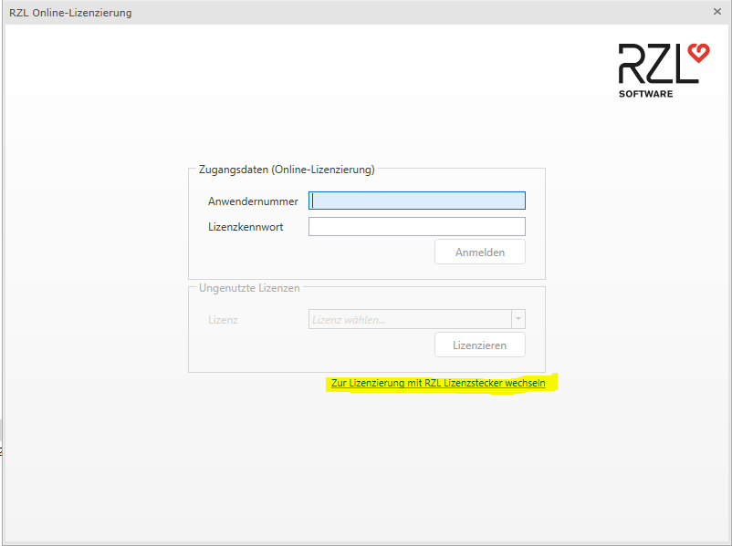

# RZL Lizenzierung

Beim ersten Start eines beliebigen RZL Programms werden Sie aufgefordert, die
Installation zu lizenzieren. Geben Sie hierzu in der folgenden Eingabemaske
Ihre Anwendernummer und Ihr Lizenzkennwort ein.

[*Kurzanleitung Online-Lizenzierung*](https://neu.rzlsoftware.at/fileadmin/user_upload/PDF_Kurzanleitungen/TECHNIK/TECHNIK_Online-Lizenzierung.pdf)  

!!! warning "Hinweis"  
    Sollte Ihnen noch ein Lizenzstecker (USB-Gerät) vorliegen, bitten wir Sie bald als möglich auf die Onliine-Lizenzierung wechseln.

  