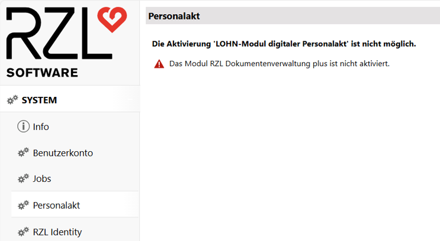
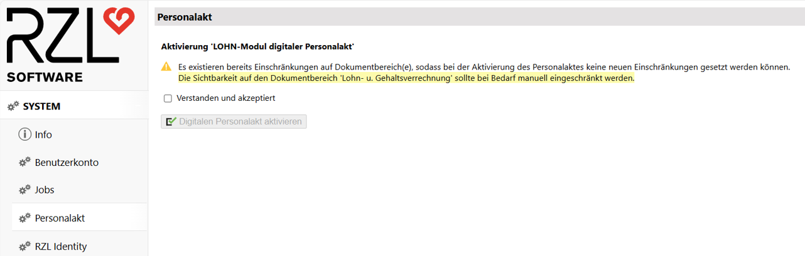
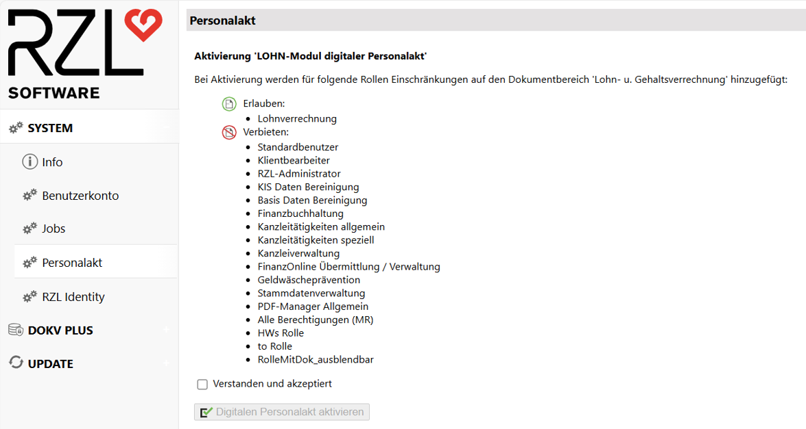

# Personalakt aktivieren

Die Aktivierung des Personalakts erfolgt benutzerfreundlich über die
Web-Oberfläche des RZL Dienstes. Gehen Sie dabei wie folgt vor:

1.  Navigation  
    Öffnen Sie die Startseite des RZL Dienstes und wechseln Sie in den Bereich
    *System*. Dort finden Sie den Menüpunkt *Personalakt*.

2.  Lizenzvoraussetzung prüfen  
    Um den Personalakt aktivieren zu können, ist eine gültige Lizenz für die
    **Dokumentenverwaltung Plus** erforderlich. Diese muss bereits aktiviert
    worden sein. Ist dies nicht der Fall, erscheint ein entsprechender Hinweis.

    
    
    Informationen zur Aktivierung der Dokumentenveraltung Plus finden Sie
    im Kapitel [*Dokumentenverwaltung Plus einrichten*](dokvplus-einrichten.md).

3.  Aktivierung durchführen  
    Sobald die Lizenz für die Dokumentenverwaltung Plus aktiv ist, erhalten Sie
    je nach Lizenztyp des Berechtigungssystems unterschiedliche Hinweise.
    
    1.  Berechtigungsystem Premium  
        Wenn Sie das Berechtigungssystem Premium lizenziert haben und bereits
        Einschränkungen auf bestimmte Dokumentbereiche gesetzt haben, erscheint
        vor Aktivierung folgender Hinweis. Diesen müssen Sie mittels Aktivierung
        der Checkbox *Verstanden und akzeptiert* bestätigen, um den Personakt
        freischalten zu können.

        
    
    2.  Berechtigungsssystem Basis  
        Wenn Sie kein Premium-Berechtigungssystem lizenziert haben, entfällt
        die Möglichkeit zur Einschränkung auf Dokumentbereiche und Sie bekommen
        folgenden Hinweis. Bitte lesen Sie diesen aufmerksam durch und aktivieren
        Sie anschließend die Checkbox *Verstanden und akzeptiert*

        

Nach Bestätigung der Hinweise können Sie den Personalakt mit einem Klick
auf *Digitalen Personalakt aktivieren* freischalten.