# Programmaktualisierung

Die regelmäßige Aktualisierung der RZL-Programme ist für den
ordnungsgemäßen Betrieb zwingend notwendig und vom Lizenznehmer
verpflichtend durchzuführen.

## Voraussetzungen

Um eine Programmaktualisierung durchführen zu können, müssen folgende
Voraussetzungen erfüllt sein:

- Eine Internetverbindung muss vorhanden sein.
- Falls der *RZL Update-Service* nicht installiert ist, sind *lokale
  Administratorrechte* notwendig (der RZL Update-Service wird
  standardmäßig automatisch installiert).
- Falls *Kanzlei-Informations-System / Board* oder *Firmen-Board mit
  Basis-Modul Belege* installiert ist, sind erweiterte Benutzerrechte
  auf die SQL-Datenbank notwendig ([siehe Kapitel 12.8](#zusätzliche-
  konfigurationen-optional)).
- Wird der RZL-Dienst eingesetzt, kann die Aktualisierung nicht mehr
  an jedem beliebigen Arbeitsplatz gestartet werden, sondern nur noch
  auf dem Gerät, auf dem der RZL-Dienst installiert ist ([siehe
  Kapitel 14](#rzl-dienst-installieren)).

## Aktualisierung starten

Zum Starten einer Programmaktualisierung stehen Ihnen drei
Möglichkeiten zur Verfügung.

### 1. Aktualisierungshinweis

Wenn Sie ein RZL-Programm starten und eine Aktualisierung verfügbar
ist, werden Sie über eine gelbe Leiste darauf hingewiesen.

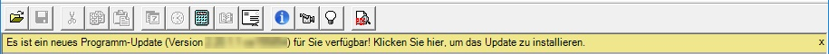

Klicken Sie auf die gelbe Leiste.

Falls Sie die Aktualisierung später durchführen möchten, können Sie
die gelbe Leiste mit dem *x* auf der rechten Seite schließen und sich
zu einem späteren Zeitpunkt daran erinnern lassen.

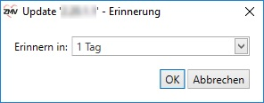

### 2. Manuell nach einer Aktualisierung suchen

Klicken Sie dazu im RZL-Programm in der Menüleiste auf *Hilfsmittel*
und anschließend auf *Programmaktualisierung...*

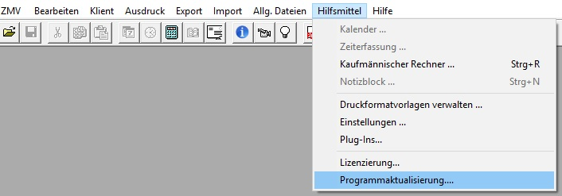

### 3. RZL-Admin

Im RZL-Admin unter *Informationen zur Installation und Update der
Programme* auf *Update der Programme* klicken und dann *Update
durchführen* auswählen.

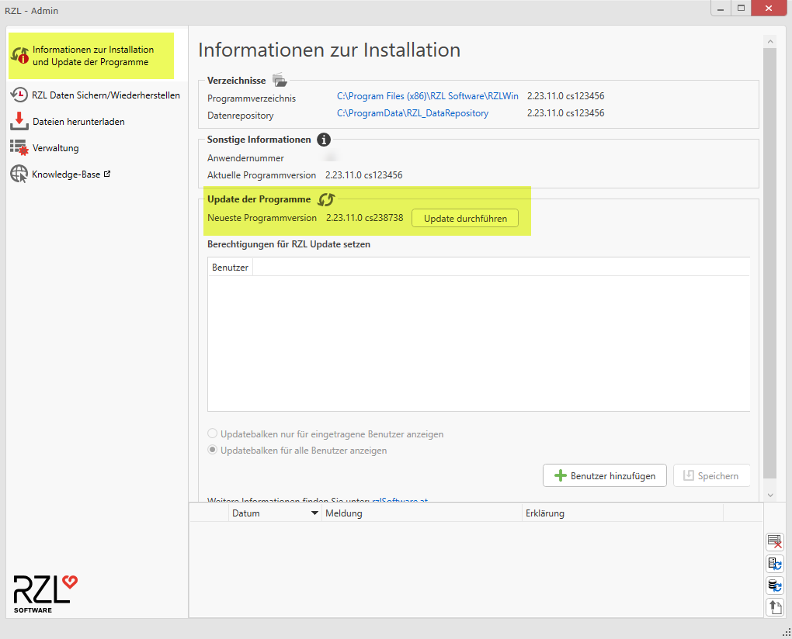

## Aktualisierung durchführen

Nach dem Start der Aktualisierung wird das Update automatisch
heruntergeladen. Es erscheint ein neues Fenster, das über den
Download-Fortschritt informiert.

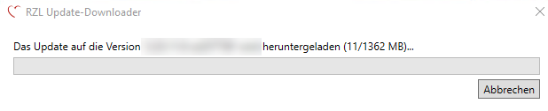

Sobald der Download abgeschlossen ist, öffnet sich das RZL-Setup in
der neuen Version zur Durchführung der Aktualisierung. **Schließen Sie
jetzt bitte sämtliche Programme** (nicht nur die RZL-Programme), damit
der Aktualisierungsvorgang problemlos durchgeführt werden kann.

Bestätigen Sie die Lizenzbestimmungen und klicken Sie auf *Weiter*.

Klicken Sie anschließend auf *Aktualisieren*, um den Vorgang zu
starten.

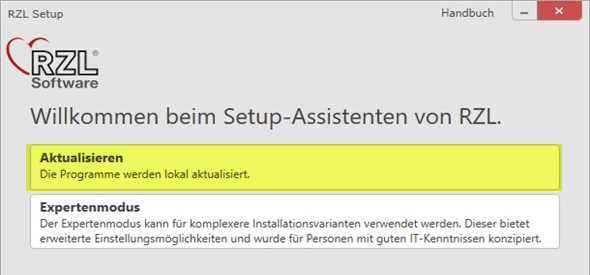

Nach Abschluss der Aktualisierung können Sie das RZL-Setup mit einem
Klick auf *Fertigstellen* beenden.

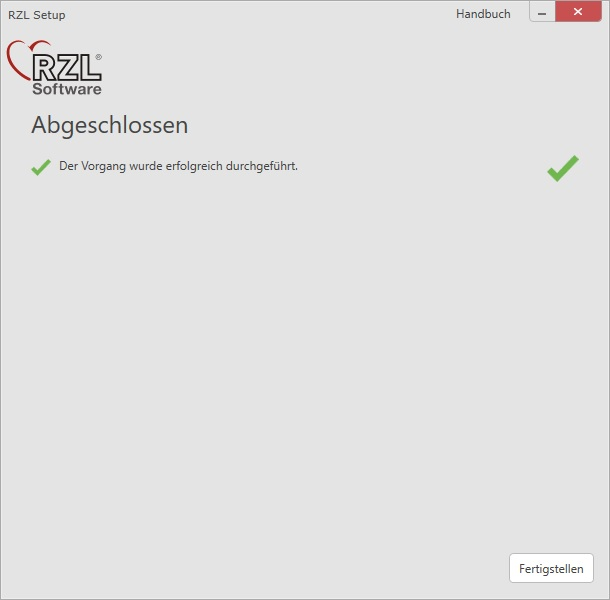

### Aktualisierung der weiteren Arbeitsplätze (bei Netzwerkinstallation)

Bei einer Netzwerk-Installation müssen alle Arbeitsplätze die gleiche
RZL-Programmversion aufweisen. Noch nicht aktualisierte Arbeitsplätze
erkennen beim nächsten Start selbstständig, dass sie veraltet sind,
und führen automatisch eine Aktualisierung über den RZL Update-Dienst
durch.

Falls der Update-Dienst nicht installiert ist, muss die Aktualisierung
als lokaler Administrator manuell durchgeführt werden.

## Bestimmte Benutzer für das RZL-Update berechtigen

Standardmäßig sind alle Benutzer berechtigt, ein Update durchzuführen.

**Achtung:** Bei Einsatz von KIS/Board bzw. Firmen-Board sind
zusätzlich spezielle Rechte auf der Datenbank notwendig.

Um nur bestimmte Benutzer für das Update zu berechtigen, gehen Sie wie
folgt vor:

1.  Starten Sie über das Windows-Startmenü den *RZL-Admin*.

    

2.  Klicken Sie in der Navigationsleiste auf *Informationen zur
    Installation und Update der Programme*.

    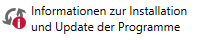

3.  Scrollen Sie in der Ansicht bis zur Überschrift *Update der Programme*.

    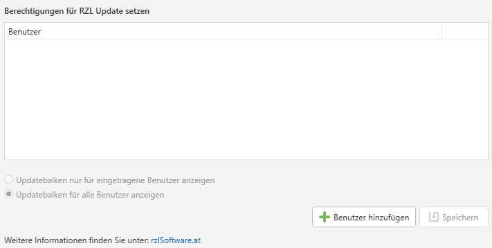

4.  Über die Schaltfläche *Benutzer hinzufügen* können Sie nun einem
    bestimmten Benutzer die Update-Berechtigung erteilen.

5.  Nach dem Klicken der Schaltfläche *Benutzer hinzufügen*

    
    
    öffnet sich folgendes Fenster:

    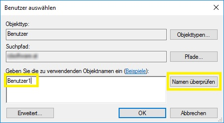

    Geben Sie den Benutzernamen ein und klicken Sie auf *Namen
    überprüfen*. Falls der Name erfolgreich überprüft wurde, können Sie
    den Benutzer mit *OK* hinzufügen.

    Um weitere Benutzer für das Update zu berechtigen, wiederholen Sie
    Schritt 5.

6.  Speichern Sie die Änderungen, um die hinzugefügten Benutzer für das
    Update zu berechtigen, indem Sie auf die Schaltfläche *Speichern*
    klicken.

## Updatebalken für nicht update-berechtigte Benutzer ausblenden

Um den Updatebalken für nicht update-berechtigte Benutzer auszublenden,
führen Sie folgende Schritte durch:

1.  Starten Sie über das Windows-Startmenü den *RZL-Admin*.

    

2.  Klicken Sie in der Navigationsleiste auf *Informationen zur
    Installation und Update der Programme*.

    

3.  Scrollen Sie bis zur Überschrift *Update der Programme*.
    Hier finden Sie zwei Optionen:

    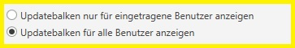

    -   **Option 1: Updatebalken nur für eingetragene Benutzer anzeigen**
  
        Der Updatebalken wird nur den Benutzern angezeigt, die in der
        Liste der updateberechtigten Benutzer eingetragen sind.
   
    -   **Option 2: Updatebalken für alle Benutzer anzeigen**

        Der Updatebalken wird für alle Benutzer angezeigt. Dies gilt auch,
        wenn kein Benutzer explizit für das Update berechtigt wurde
        (Standardfall).

    Erst nach dem Speichern wird die gewählte Option aktiv.