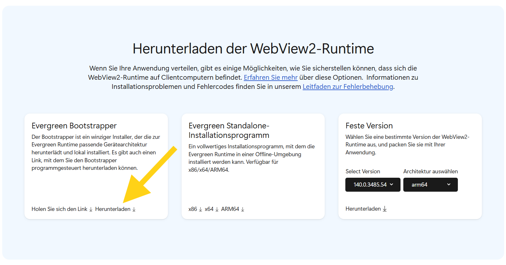

# WebView2 Runtime nicht verfügbar

## Problembeschreibung

Die RZL Programme verwenden an unterschiedlichen Stellen eine Komponente von Microsoft (die WebView2 Runtime), um Webinhalte anzeigen zu können.  
Für die Installation dieser Komponente wird bei der RZL Programmaktualisierung ein Installationspaket von Microsoft heruntergeladen und installiert. Steht zu diesem Zeitpunkt keine Internetverbindung zur Verfügung, kann es vorkommen, dass die WebView2 Runtime nicht installiert wird.

## Lösung

1. Öffnen Sie die Seite von [Microsoft Edge WebView2 &#8599;](https://developer.microsoft.com/de-de/microsoft-edge/webview2/#download-section){:target="_blank"}.
2. Klicken Sie dort auf **Herunterladen** und führen Sie die Anweisungen zum Installieren der WebView2 Runtime aus.   

!!! warning "Hinweis für Terminalserver-Nutzung"  
    Wenn Sie das Installationsprogramm mit erhöhten Rechten ausführen, wird die Runtime pro Computer installiert und steht somit sofort allen Benutzern des Servers zur Verfügung.

