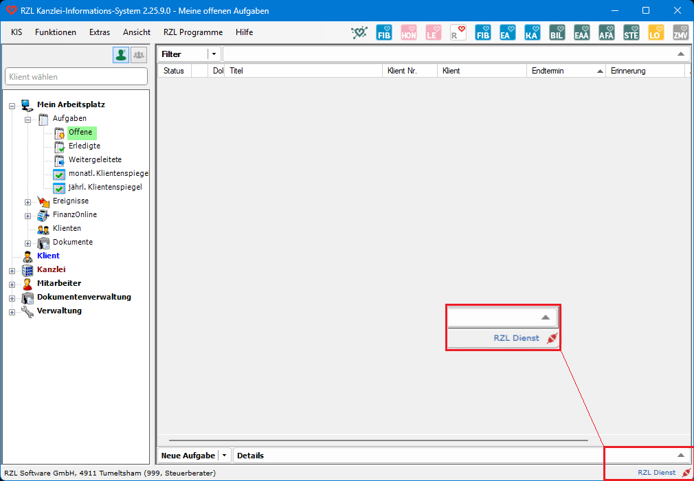

# Ausfall RZL-Dienst

## Problembeschreibung

Liebe Anwenderinnen, liebe Anwender,

Ihr RZL-Dienst wird zum aktuellen Zeitpunkt nicht mehr ausgeführt. Ein Ausfall führt zum temporären Funktionsverlust von Programmen und Modulen, welche auf den RZL-Dienst angewiesen sind:

- Programm RZL Hon Next
- Programm RZL Fibu Next
- Modul KIS-Schnittstelle Scanner-Anbindung
- Modul Dokumentenverwaltung Plus
- Modul Digitaler Personalakt
- Modul EBICS

Es gibt verschiedene Auslöser für den Ausfall des RZL-Dienstes. In diesem Artikel stellen wir Ihnen die gängigsten Lösungsansätze in Form einer [Checkliste &#8599;](../doc/ausfall_rzldienst_checkliste.pdf){:target="_blank"} zur Verfügung.

**Ausfall RZL-Dienst – Sicht aus dem KIS**  
(Rotes Dienst-Symbol rechts unten im Bild. Fehlerbericht kann unter dem blau gefärbten Schriftzug „RZL Dienst“ abgerufen werden.)

**RZL-Dienst-Ausfall – Sicht aus dem RZL Admin**  

