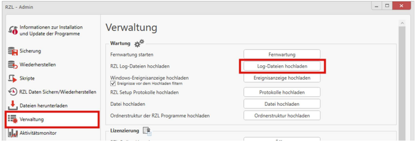
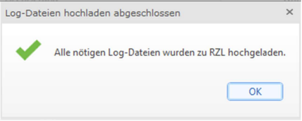
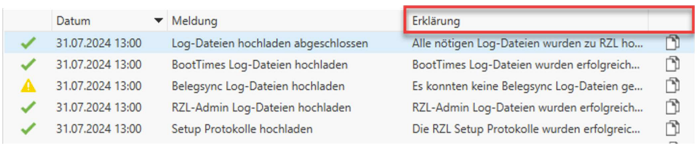

# Log-Dateien hochladen

Für genauere Analysen generiert RZL im Laufe der Zeit Log-Dateien. Diese sind für unseren Support unverzichtbar, um zielführende Lösungsansätze für auftretende Probleme bereitstellen zu können.

1. Öffnen Sie das Programm **RZL-Admin**.
2. Wählen Sie den Reiter **Verwaltung** aus.
3. Klicken Sie auf **„Log-Dateien hochladen“**.
4. Nach Abschluss des Hochladevorgangs erhalten Sie eine Bestätigungsmeldung.

## Mögliche Meldungen

Tritt bei der Übermittlung eine Warnung auf, finden Sie im Reiter **Erklärung** genauere Details.

Bei Bedarf setzen Sie sich bitte mit unserem technischen Support in Verbindung.