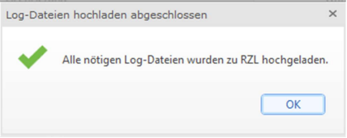

# Log-Dateien hochladen

Für genauere Analysen generiert RZL im Laufe der Zeit Log-Dateien. Diese Logdateien sind für unseren Support essenziell, um zielführende Lösungsansätze für auftretende Probleme bereitstellen zu können.

1. Öffnen Sie das Programm **RZL-Admin**.
2. Wählen Sie den Reiter **Verwaltung** aus.
3. Klicken Sie auf **„Log-Dateien hochladen“**.
4. Nach Abschluss des Hochladevorgangs erhalten Sie eine Bestätigungsmeldung.

## Mögliche Meldungen

Gegebenenfalls kann es vorkommen, dass bei der Übermittlung eine Warnung oder ein Fehlerbericht ausgegeben wird. Im Reiter **Erklärung** erhalten Sie dazu genauere Details.

Bei Bedarf nehmen Sie Kontakt mit unserem technischen Support auf.