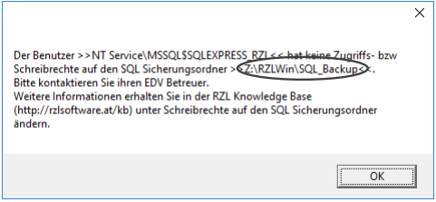

# Schreibrechte auf den SQL-Sicherungsordner ändern

Sollten Sie am Ende der Installation folgenden Dialog erhalten, müssen Sie die Zugriffsberechtigung auf Ihren SQL-Sicherungsordner ändern.   

Dies ist notwendig, da sich in einer zukünftigen Version das Sicherungssystem ändern wird. Damit es bei der Umstellung auf das neue Sicherungssystem nicht zu Problemen kommt, empfehlen wir Ihnen, die Zugriffsrechte auf den SQL-Sicherungsordner wie in dieser Anleitung beschrieben zu ändern.

> **Hinweis**
Diese Anleitung ist für EDV-Betreuer vorgesehen. Falls Sie nicht selbst EDV-Betreuer sind, lassen Sie die Änderungen durch Ihren EDV-Betreuer durchführen und weisen Sie ihn auf diese Anleitung hin.

Den Pfad zu Ihrem SQL-Sicherungsordner entnehmen Sie dem Dialog.  
**Beispiel:**  
`Z:\RZLWin\SQL_Backup`

## Benutzer mit Lese-/Schreibberechtigung ermitteln

Den Benutzer, dem Sie Lese-/Schreibberechtigung auf den SQL-Sicherungsordner gewähren müssen, entnehmen Sie ebenfalls dem Dialog.  
**Beispiel:**  
`NT Service\MSSQL$SQLEXPRESS_RZL`

## Sicherungsordner im Windows Explorer öffnen

Öffnen Sie im Windows Explorer den Pfad zu Ihrem Sicherungsordner:  
**Beispiel:**  
`Z:\RZLWin\SQL_Backup`

## Eigenschaften des Ordners öffnen

1. Klicken Sie mit der rechten Maustaste auf den Ordner und wählen Sie **Eigenschaften**.
2. Wechseln Sie zum Reiter **Sicherheit**.
3. Klicken Sie auf die Schaltfläche **Bearbeiten**.

## Benutzer hinzufügen

1. Klicken Sie auf **Hinzufügen**.
2. Geben Sie den Benutzernamen ein (z. B. `NT Service\MSSQL$SQLEXPRESS_RZL`).
3. Sollte der Benutzer nicht gefunden werden, ändern Sie den Suchpfad über die Schaltfläche **Pfade** auf Ihren Computer (z. B. „v-81“).
4. Bestätigen Sie mit **OK**.

## Berechtigungen vergeben

1. Wählen Sie den hinzugefügten Benutzer aus.
2. Aktivieren Sie **Vollzugriff** für diesen Benutzer.
3. Bestätigen Sie alle Dialoge mit **OK**.

Nun haben Sie die Zugriffsberechtigung auf den Sicherungsordner erfolgreich geändert.