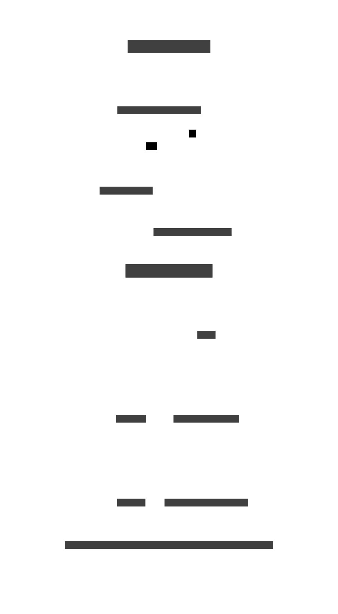

# RZL Hilfe

Die erste live Preview kann [hier](https://purple-wave-084806310.4.azurestaticapps.net/) gefunden werden.

Die RZL Hilfe gebaut aus Markdown File mit Hilfe von [Material for MkDocs](https://squidfunk.github.io/mkdocs-material/).

## Contribute

Für das Anpassen und Erstellen der RZL Hilfe werden [GitHub Codespaces](https://github.com/features/codespaces) verwendet.
Dadurch kann sichergestellt werden, dass alle Abhängigkeiten und Tools bereits installiert und richtig eingerichtet sind.

Der Ablauf für das Starten eines Codespaces ist wie folgt:


Ist der Codespace vollständig gestartet und im [Visual Studio Code](https://code.visualstudio.com/) geöffnet, kann mit dem drücken der `F5` Taste eine live Preview gestartet werden.

Im Hintergrund führt `F5` diesen Befehl aus:
```
mkdocs serve
```
