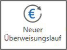
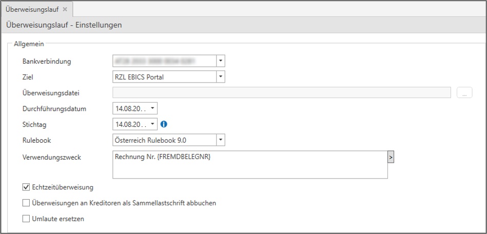
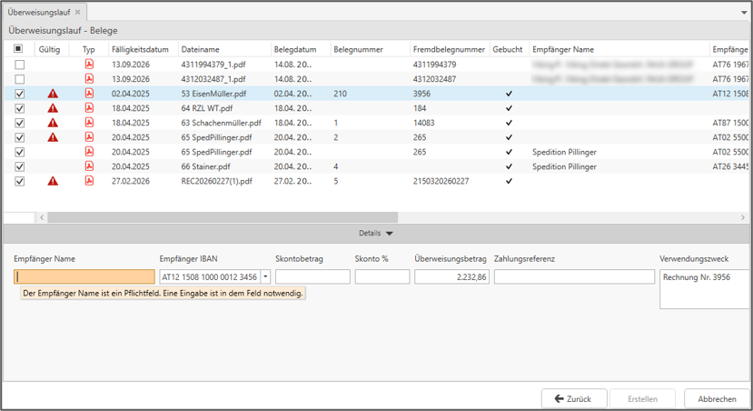
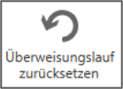
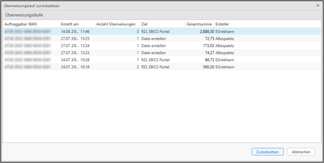

Mit dem Modul *Überweisungen* erledigen Sie die Zahlung Ihrer offenen Eingangsbelege bequem direkt in der RZL Belegverarbeitung. Sobald ein Beleg zur Zahlung freigegeben ist, können Sie ihn per Überweisungslauf begleichen, unabhängig davon, ob er bereits gebucht ist oder nicht. Die Überweisungen können dabei, sofern für Ihre Bankverbindung eingerichtet, direkt über die EBICS-Schnittstelle bereitgestellt werden - alternativ können Sie eine Überweisungsdatei für den manuellen Upload ins Onlinebanking erzeugen.

## Überweisungslauf starten
Öffnen Sie zunächst den gewünschten Klienten. Der Überweisungslauf kann in folgenden Menüpunkten durch Klick auf die neue Schaltfläche *Neuer Überweisungslauf* gestartet werden: 

- *BELEGE / Ungebuchte Belege* - wenn die Belegfreigabe nicht lizensiert ist.
- *BELEGE / Belegfreigabe* - wenn die Belegfreigabe lizensiert ist (ersetzt in diesem Fall den Menüpunkt *Ungebuchte Belege*)
- *BELEGE / Gebuchte Belege*

Unabhängig davon, über welche Ansicht Sie einsteigen, öffnet sich anschließend ein neuer Tab *Überweisungslauf* mit den Einstellungen für die Erstellung der Überweisungsdatei.

:::caution[Hinweis]

In der darauffolgenden Belegliste stehen Ihnen dabei stets sowohl gebuchte als auch ungebuchte Belege zur Auswahl, unabhängig davon, über welche Ansicht Sie eingestiegen sind.

:::

## Einstellungen für den Überweisungslauf
Bevor die Belegliste angezeigt wird, treffen Sie die grundlegenden Einstellungen für den Überweisungslauf:

- **Bankverbindung:** Hier kann aus allen im Personen-/Firmenstamm angelegten Bankverbindungen gewählt werden, von welcher die Überweisung getätigt werden soll.
- **Ziel:** Wahlweise wird eine Überweisungsdatei erstellt oder die Überweisung im RZL EBICS Portal für die Übermittlung an die Bank bereitgestellt (falls für die ausgewählte Bankverbindung eingerichtet).
- **Überweisungsdatei:** Wurde bei Ziel *Datei erstellen* ausgewählt, ist hier der Dateipfad zu hinterlegen, wo die Überweisungsdatei für die weitere Verarbeitung abgelegt werden soll.
- **Durchführungsdatum:** Das gewünschte Ausführungsdatum der Überweisung. Es darf nicht in der Vergangenheit liegen.
- **Stichtag:** Steuert, welche offenen Beträge in den Überweisungslauf einbezogen werden.
- **Rulebook:** Standardmäßig ist das aktuelle SEPA-Rulebook vorausgewählt.
- **Verwendungszweck:** Hier kann ein Standard-Verwendungszweck festgelegt werden. Dieser kann im nächsten Schritt pro Beleg überarbeitet werden. Sollte bei einem Beleg eine Zahlungsreferenz erfasst worden sein, wird der Verwendungszweck nicht mit übermittelt.
- **Echtzeitüberweisung:** Ist standardmäßig aktiviert.
- **Überweisungen an Kreditoren als Sammellastschrift abbuchen:** Der gesamte Überweisungsbetrag dieses Überweisungslaufs wird in Summe von Ihrem Konto abgebucht. Ist diese Option nicht gesetzt, ist jede einzelne Überweisung am Kontoauszug ersichtlich.

## Belegauswahl
### Belegliste
Nach Klick auf *Weiter* erscheint eine Liste aller freigegebenen, noch nicht bezahlten Eingangsbelege - gebucht oder ungebucht. Belege die als Gutschrift markiert sind oder bei denen noch keine Buchungs- oder Zahlungsfreigabe vorliegt, werden nicht angezeigt.

Alle fälligen Belege werden in der ersten Spalte automatisiert angehakt. Diese Vorauswahl kann manuell bearbeitet werden. In der Spalte *Gültig* wird angezeigt, ob alle erforderlichen Informationen für die Überweisung vorhanden sind. Die Überweisung kann erst abgeschlossen werden, wenn alle ausgewählten Überweisungen gültig sind.

Über das PDF-Symbol kann der jeweilige Beleg geöffnet werden - bei Klick in eine andere Zeile aktualisiert sich die Belegansicht automatisch.

Hinterlegte Zahlungs- und Skontofristen werden ebenfalls angezeigt und ein gültiger Skonto automatisiert abgezogen.

Die gewohnten Filter- und Sortierfunktionen stehen Ihnen auch hier zur Verfügung.

### Überweisungsdetails bearbeiten
Folgende Felder können im Detailbereich pro Beleg manuell bearbeitet werden:

- **Empfänger Name**
- **Empfänger IBAN:** Über das Drop-Down können Sie aus den bei diesem Empfänger hinterlegten IBANs wählen, oder den IBAN händisch erfassen.
- **Skontobetrag**
- **Skonto %**
- **Überweisungsbetrag:** Standardmäßig wird hier der Bruttobetrag des Belegs abzüglich etwaiger Skonti angeführt. Um eine Teilzahlung zu tätigen, können Sie den Überweisungsbetrag auch manuell festlegen.
- **Zahlungsreferenz**
- **Verwendungszweck:** Ist das Feld Zahlungsreferenz befüllt, kann kein Verwendungszweck mehr erfasst werden bzw. wird dieser bei der Überweisung nicht mitübermittelt.

:::caution[Hinweis]

Die Schaltfläche *Erstellen* ist so lange deaktiviert, bis alle angehakten Zeilen vollständig und gültig sind.

:::

## Überweisungsdatei erstellen
Über die Schaltfläche *Erstellen* wird die Überweisungsdatei erzeugt - je nach Einstellung als Datei am gewählten Speicherort oder direkt über EBICS. Bei allen enthaltenen Belegen wird anschließend automatisch:

- das Feld *Bezahlt am* Durchführungsdatum befüllt,
- die eingebene *Zahlungsreferenz* bzw. der Verwendungszweck übernommen.

Die Belege gelten damit als bezahlt und werden in einem künftigen Überweisungslauf nicht mehr vorgeschlagen.

## Überweisungslauf zurücksetzen
Wurde ein Überweisungslauf versehentlich oder fehlerhaft erstellt, kann er über die Schaltfläche *Überweisungslauf zurücksetzen* wieder rückgängig gemacht werden:

Die Schaltfläche finden Sie stets neben dem Button *Neuer Überweisungslauf*.

Es öffnet sich eine Liste der bisher durchgeführten Überweisungsläufe:

Wählen Sie den Überweisungslauf aus, den Sie zurücksetzen möchten und bestätigen Sie mit *Zurücksetzen*. Das eingetragene Zahlungsdatum im Feld *Bezahlt am* wird bei den betroffenen Belegen entfernt, sodass diese im nächsten Überweisungslauf erneut vorgeschlagen werden.
