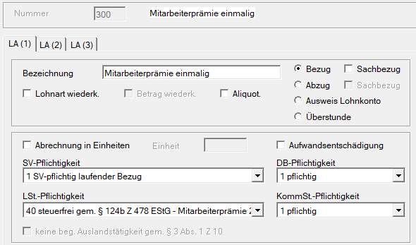
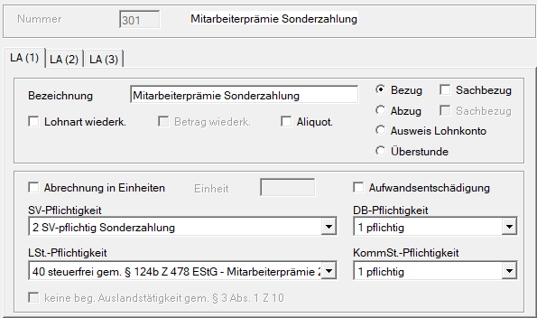
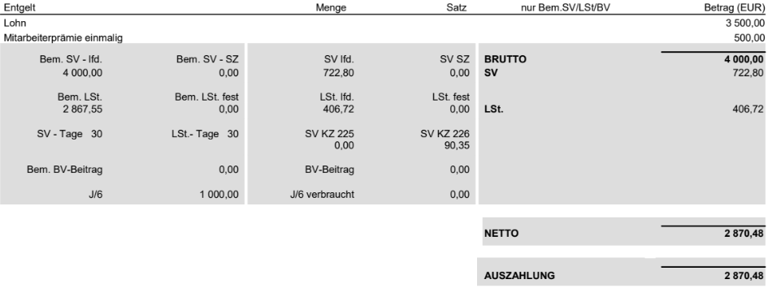
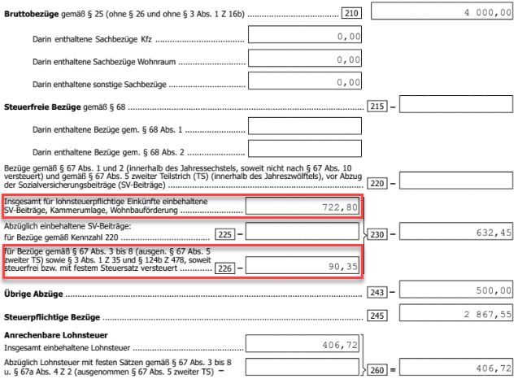
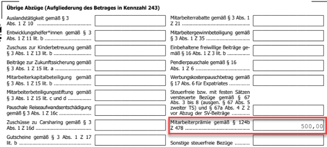
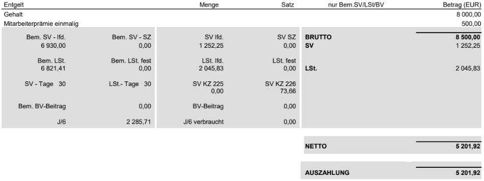

Im Kalenderjahr 2026 ist es unter bestimmten Formalvoraussetzungen möglich, die **Mitarbeiterprämie** bis zur Höhe von EUR 500,00 pro Arbeitnehmer steuerfrei zu gewähren (§&nbsp;124b Z 478 lit. f EStG).

## Anspruchsgrundlage

Die Zahlung muss aufgrund einer lohngestaltenden Vorschrift gemäß § 68 Abs. 5 Z 5 oder 6 EStG gewährt werden. Rechtsgrundlage für die Zahlung können daher sein:

- ein (Zusatz-)Kollektivvertrag, der einen Anspruch auf Mitarbeiterprämie 2026 festlegt
- ein (Zusatz-)Kollektivvertrag, der zur Regelung einer Mitarbeiterprämie durch Betriebsvereinbarung ermächtigt, kombiniert mit einer auf dieser Grundlage abgeschlossenen Betriebsvereinbarung. In Betrieben ohne Betriebsrat kann aufbauend auf der kollektivvertraglichen Ermächtigung auch eine Vereinbarung für alle Arbeitnehmer geschlossenen werden.
- in Branchen, in denen es keinen kollektivvertragsfähigen Arbeitgeberverband gibt (z. B. Vereine, die nicht WKO-Mitglied sind), eine Betriebsvereinbarung mit zusätzlicher ÖGB-Unterschrift. In Betrieben ohne Betriebsrat kann in diesem Fall auch eine Vereinbarung für alle Arbeitnehmer geschlossenen werden.

Das bedeutet: **In Branchen, in denen es einen Arbeitgeberverband gibt** (somit bei allen Betrieben, die Mitglied in der Wirtschaftskammer, einer anderen Kammer oder einer freiwilligen Interessensvereinigung sind), **können steuerfreie Mitarbeiterprämien im Jahr 2026 ausschließlich durch Kollektivvertrag festgelegt** werden.

## Auszahlungszeitpunkt

Begünstigt sind nur zusätzliche Zulagen und Bonuszahlungen, die der Arbeitgeber in den Kalendermonaten **Juli bis Dezember 2026** gewährt. Das bedeutet:

- Arbeitgeber, die in der Hoffnung auf einen positiven Ausgang der Evaluierung der Mitarbeiterprämie für 2026 bereits im ersten Halbjahr Auszahlungen vorgenommen haben, können die Lohnsteuerbegünstigung für die Mitarbeiterprämie 2026 nicht auf diese Zahlungen anwenden.
- Die zweite Kaufkraftsicherungsprämie in der Metallindustrie erfüllt diese Vorgabe, da der Kollektivvertrag die Auszahlung im Juli 2026 vorsieht.
- Die Zahlung der Mitarbeiterprämie muss nach dem Gesetzeswortlaut spätestens im Kalendermonat Dezember 2026 erfolgen. Nach den Erläuterungen zur Regierungsvorlage kann eine Nachzahlung nach § 77 Abs 5 EStG bis zum 15. 2. 2027 mittels Aufrollung als steuerfreie Mitarbeiterprämie 2026 berücksichtigt werden. Das setzt voraus, dass die gewährte Mitarbeiterprämie im Jahr 2026 fällig ist, aber eine rechtzeitige Auszahlung aufgrund besonderer Umstände nicht erfolgen kann. Die Festlegung durch die Sozialpartner und der Abschluss von Betriebsvereinbarungen auf dieser Grundlage müssen daher dennoch in dem sportlich kurzen Zeitraum von rund sechs Monaten ab Gesetzwerdung bewältigt werden.

## Begünstigte Höhe

Die Mitarbeiterprämie 2026 soll für den einzelnen Arbeitnehmer bis **EUR 500** steuerfrei sein. Eine im Kalenderjahr 2026 ebenfalls ausbezahlte Gewinnbeteiligung gemäß § 3 Abs 1 Z 35 EStG ist nur insoweit steuerfrei, als sie gemeinsam mit der Mitarbeiterprämie den Betrag von EUR&nbsp;3.000,00 pro Kalenderjahr nicht übersteigt.

Wird mehr als EUR 500,00 für die Mitarbeiterprämie steuerfrei berücksichtigt und gleichzeitig der Gesamtbetrag von EUR 3.000,00 für die Mitarbeiterprämie und Gewinnbeteiligung überschritten, besteht ein Pflichtveranlagungstatbestand gem. [§&nbsp;41&nbsp;Abs.&nbsp;1 EStG](https://www.ris.bka.gv.at/NormDokument.wxe?Abfrage=Bundesnormen&Gesetzesnummer=10004570&Artikel=&Paragraf=41&Anlage=&Uebergangsrecht=).

## Keine Befreiung im Bereich der Sozialversicherung, DB/DZ und Kommunalsteuer

Für das Jahr 2026 sieht der Gesetzgeber **keine Befreiung** im Bereich der **Sozialversicherung** sowie der Nebenabgaben **DB/DZ** und **Kommunalsteuer** vor.

Es ist nicht möglich, die auf die Prämie entfallenden Dienstnehmeranteile zur Sozialversicherung bei der Ermittlung der Lohnsteuer-Bemessungsgrundlage abzuziehen (laut [§ 20 Abs. 2 EStG](https://www.ris.bka.gv.at/NormDokument.wxe?Abfrage=Bundesnormen&Gesetzesnummer=10004570&Artikel=&Paragraf=20&Anlage=&Uebergangsrecht=)). Das bedeutet, dass sich der Auszahlungsbetrag an die Dienstnehmer nicht um den vollen steuerfreien Maximalbetrag von EUR 500,00 erhöht, sondern nur um einen entsprechend geringeren Nettobetrag.

Wie in [§ 124b Z 478 lit. f sublit. aa EStG](https://www.ris.bka.gv.at/NormDokument.wxe?Abfrage=Bundesnormen&Gesetzesnummer=10004570&Artikel=&Paragraf=124b&Anlage=&Uebergangsrecht=) festgelegt, erhöht die Mitarbeiterprämie 2026 das Jahressechstel **nicht**.

Die Abrechnung der Mitarbeiterprämie 2026 in der RZL Lohnverrechnung muss über eine neu anzulegende freie Lohnart erfolgen. Diese ist entweder unter *Stamm / Lohnarten* oder in der Kanzleilohnartentabelle unter *Klient / Kanzlei / Lohnarten, Lohnformeln* anzulegen.

## Abrechnung in der RZL Lohnverrechnung

Die Entscheidung ob im Bereich der Sozialversicherung ein **laufender Bezug** oder eine **Sonderzahlung** vorliegt, muss in jedem Einzelfall sorgfältig abgewogen werden. Dabei kommt es nicht nur auf den Zeithorizont der Auszahlung an, sondern auch auf die Frage, ob mit dem Dienstnehmer eine wiederholte Gewährung der Prämie vereinbart wurde oder nicht.

Zudem ist zu klären, ob aus der bisherigen Auszahlung von Corona-Prämien, Teuerungsprämien oder Mitarbeiterprämie 2024 und 2025 eine wiederkehrende Zahlung abgeleitet werden kann – oder eben nicht.

### Erstmalige, absolut einmalige Gewährung ohne Vereinbarung einer Wiederkehr

Wird keine Wiederkehr vereinbart und handelt es sich um den erstmaligen Bezug der Mitarbeiterprämie, liegt in der Sozialversicherung ein laufender Bezug vor (**SV-Pflichtigkeit = 1**).

{width="500"}

:::caution[Hinweis]
Unser Vorschlag zur Anlage der Lohnart basiert auf dem Informationsstand aus verschiedenen Fachartikeln mit Stand **Juli 2026**. Die Letztverantwortung für die korrekte Anlage der Lohnarten liegt beim Anwender.

:::
Im Bereich der Lohnsteuer gibt es eine eigene Lohnsteuerpflicht-Nr. **40 steuerfrei gem. § 124b Z 478 EStG – Mitarbeiterprämie 2025 u. 2026**.

Eine Befreiung von den **Lohnnebenkosten** (DB, DZ und Kommunalsteuer) ist vom Gesetzgeber nicht vorgesehen. In diesem Bereich muss die Lohnart daher als **1 = pflichtig** definiert werden.

### Wiederkehrender Bezug

Wird hingegen bereits im Vorfeld eine mehrmalige Auszahlung dieser Lohnart vereinbart, gilt sie im Bereich der Sozialversicherung als **Sonderzahlung** (**Pflichtigkeit = 2**). Alle übrigen Regelungen bleiben unverändert.

{width="500"}

:::caution[Hinweis]
Unser Vorschlag zur Anlage der Lohnart basiert auf dem Informationsstand aus verschiedenen Fachartikeln mit Stand **Juli 2026**. Die Letztverantwortung für die korrekte Anlage der Lohnarten liegt beim Anwender.

:::
### Beispiele

**Beispiel 1**

In beiden Varianten der Auszahlung (laufender Bezug oder Sonderzahlung) trifft die Pflichtigkeit in der Sozialversicherung auf eine Abgabenbefreiung in der Lohnsteuer. Diese inzwischen seltene Konstellation führt - insbesondere im Zusammenhang mit der Darstellung am L16 (Jahreslohnzettel) - dazu, dass die SV-Dienstnehmeranteile „neutralisiert“ werden müssen. Gemäß [§ 20 Abs. 2 EStG](https://www.ris.bka.gv.at/NormDokument.wxe?Abfrage=Bundesnormen&Gesetzesnummer=10004570&Artikel=&Paragraf=20&Anlage=&Uebergangsrecht=) dürfen Sozialversicherungsbeiträge, die sich auf nicht steuerpflichtige Einkünfte beziehen, nicht als Werbungskosten vom steuerpflichtigen Einkommen abgezogen werden.

- Laufender Bezug: EUR 3.500,00
- Mitarbeiterprämie 2026 (einmalig): EUR 500,00

{width="600"}

Der gesamte SV-Dienstnehmeranteil beträgt EUR 722,80 und setzt sich wie folgt zusammen:

- EUR 632,45 entfallen auf das laufende Gehalt (3.500,00 x 18,07 %)
- EUR 90,35 entfallen auf die steuerfreie Mitarbeiterprämie 2026 (500,00 x 18,07 %)

Der auf die Mitarbeiterprämie entfallende Anteil von EUR 90,35 darf **nicht** als Werbungskosten bei der Ermittlung der Lohnsteuer-Bemessungsgrundlage berücksichtigt werden, da die zugrunde liegende Prämie steuerfrei ist.

|                                 |         |              |
| :------------------------------ | :------ | -----------: |
| Brutto                          | EUR     |     4.000,00 |
| - SV-DNA (3.500,00 x 18,07 %)   | EUR     |     - 632,45 |
| - steuerfreie Mitarbeiterprämie | EUR     |     - 500,00 |
| **Lohnsteuer-BMGL lfd.**        | **EUR** | **2.867,55** |

Im L16 (Jahreslohnzettel) wird über die Kennzahl 226 jener Teil der SV-Dienstnehmeranteile ausgeschieden, der auf die steuerfreie Mitarbeiterprämie 2026 entfällt. Dieser Anteil darf die laufende Lohnsteuer-Bemessungsgrundlage daher **nicht** mindern.

{width="600"}

{width="600"}

**Beispiel 2**

- Laufender Bezug: EUR 8.000,00
- Mitarbeiterprämie 2026 (einmalig): EUR 500,00

Bei Überschreitung der laufenden Höchstbeitragsgrundlage müssen die SV-Dienstnehmeranteile anteilig im Verhältnis der Bruttobezüge zugeordnet werden (EUR 8.000,00 = 94,12 % zu EUR&nbsp;500,00 = 5,88 %).

{width="600"}

Der gesamte SV-Dienstnehmeranteil beträgt EUR 1.252,25 und wird entsprechend dem Verhältnis 94,12 % zu 5,88 % aufgeteilt:

- EUR 1.178,59 entfallen auf den laufenden Bezug und sind abzugsfähig (1.252,25 x 94,12 %)
- EUR 73,66 entfallen auf die steuerfreie Mitarbeiterprämie 2026 und sind nicht als Werbungskosten abzugsfähig (1.252,25 x 5,88 %)

Nur der auf den steuerpflichtigen Teil entfallende Anteil der SV-Beiträge darf bei der Ermittlung der Lohnsteuer-Bemessungsgrundlage als Werbungskosten berücksichtigt werden.

|                                 |         |              |
| :------------------------------ | :------ | -----------: |
| Brutto                          | EUR     |     8.500,00 |
| - SV-DNA                        | EUR     |   - 1.178,59 |
| - steuerfreie Mitarbeiterprämie | EUR     |     - 500,00 |
| **Lohnsteuer-BMGL lfd.**        | **EUR** | **6.821,41** |

{width="600"}

Dadurch wird der Teil der Sozialversicherungsbeiträge, der auf die Mitarbeiterprämie entfällt (EUR&nbsp;73,66), über die Kennzahl 226 ausgeschieden.
