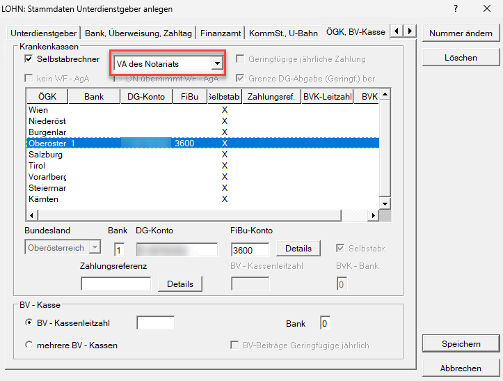
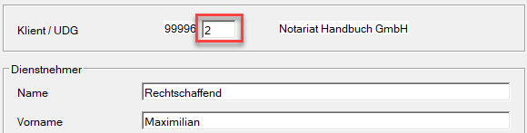
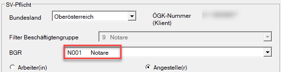
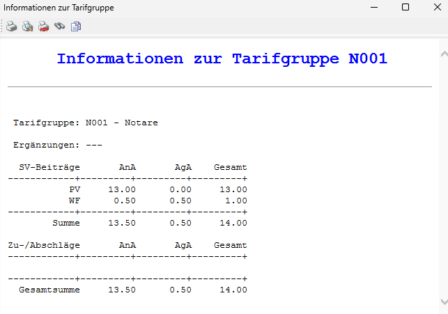

Um einen Notar bzw. Notariatsanwärter korrekt abzurechnen, müssen Sie zuerst einen [*Unterdienstgeber*](/lohn/klientenstammdaten/unterdienstgeber/) anlegen.

Im Registerblatt *ÖGK, BV-Kasse* wählen Sie bei der Option *Selbstabrechner* den Punkt *VA des Notariats* aus. Da Notare keine eigene Beitragskontonummer haben, empfiehlt es sich, die Beitragskontonummer der ÖGK zu verwenden.

{width="500"}

In der Abrechnung des Dienstnehmers müssen Sie im Abrechnungsbildschirm [*Stammdaten Dienstnehmer*](/lohn/abrechnungsbildschirme/stammdaten-dienstnehmer/) die Unterdienstgebernummer im entsprechenden Feld *Klient/UDG* eintragen.

{width="500"}

Im Anschluss daran können Sie im [*Sozialversicherungsbildschirm*](/lohn/abrechnungsbildschirme/sozialversicherung/) die Beschäftigtengruppe auf **N001 Notare** setzen.

{width="500"}

Es werden nun automatisch nur die Pensionsversicherung sowie die Wohnbauförderung berechnet.

{width="500"}

:::caution[Hinweis]
Wenn Sie die monatliche Beitragsgrundlagenmeldung (mBGM) übermitteln, erscheint ausschließlich die BV-Bemessung. Nur die Betriebliche Vorsorge wird an die ÖGK übermittelt. Die PV sowie der WF werden an die VA des Notariats überwiesen. 

:::
:::note[Tipp]
Für Notare gibt es eine *Mindestbeitragsgrundlage* der Pensionsversicherung, die vom Programm jährlich automatisch angepasst wird.
:::
