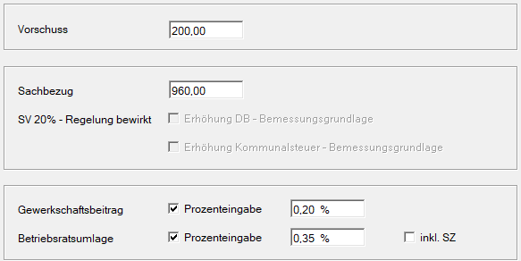

## Vorschuss

Eingabe eines vom Nettolohn abzuziehenden Vorschusses.

## Sachbezug

Eingabe des Betrages an Sachbezug (z. B. für freie Station, KFZ-Privatnutzung usw.), der vom Nettolohn abgezogen wird. Die hier eingegebenen Beträge werden lediglich abgezogen. Ist der Sachbezug nicht im Bruttolohn enthalten, so ist er als [eigene freie Lohnart](/lohn/sachbezuege/#3-sachbezugslohnart-anlegen) anzulegen, damit die Berücksichtigung bei SV und LSt erfolgen kann.

:::caution[Hinweis]
Beachtung der Sonderregelung in der Sozialversicherung: Gemäß § 53 ASVG dürfen die dienstnehmerbezogenen SV-Beiträge maximal 20 % seiner Geldbezüge betragen, wird einem Dienstnehmer ein entsprechend hoher Sachbezug abgezogen, so kann dies Auswirkung auf die dem Dienstnehmer maximal abziehbaren SV-Beiträge haben. Diese Sonderregelung wird vom Programm automatisch berücksichtigt.

:::
:::note[Tipp]
Durch einen Rechtsklick in das Feld *Sachbezug* kann der Wert *Explizit 0* ausgewählt werden. Dadurch wird der Sachbezug mit 0,00 auf der Abrechnung ausgewiesen – auch wenn kein Betrag verrechnet wird. Bei einem *Sachbezug KFZ* bewirkt diese Einstellung zusätzlich, dass die relevanten Felder für *Sachbezugsprozentsatz* und *Anschaffungskosten* sowohl auf dem Jahreslohnzettel (L16) als auch auf dem Jahreslohnkonto korrekt befüllt werden.

:::
**SV – 20 % Regelung bewirkt Erhöhung …**

Durch Aktivierung dieser Felder erfolgt eine Erhöhung der DB- und Kommunalsteuerbemessung um den vom Dienstgeber übernommenen SV-Anteil des Dienstnehmers (20-%-Regelung).

## Gewerkschaftsbeitrag und Betriebsratsumlage

**Gewerkschaftsbeitrag**

Eingabe des Betrages oder Prozentsatzes eines monatlich abzuziehenden Gewerkschaftsbeitrages. Wird hier eine Prozenteingabe vorgenommen, kann ein [maximaler Gewerkschaftsbeitrag](/lohn/klientenstammdaten/stammdaten-klient/la-formeln-texte-kontenplan-beitraege-waehrung/) in den Dienstgeberstammdaten festgelegt werden.

**Betriebsratsumlage**

Eingabe des Betrages oder Prozentsatzes einer monatlich abzuziehenden Betriebsratsumlage. Wird hier eine Prozenteingabe vorgenommen, kann eine [maximale Betriebsratsumlage](/lohn/klientenstammdaten/stammdaten-klient/la-formeln-texte-kontenplan-beitraege-waehrung/) in den Dienstgeberstammdaten festgelegt werden.
