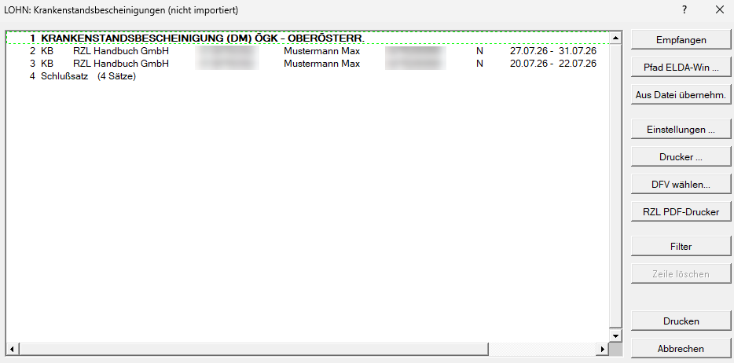
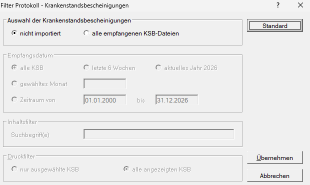

## Krankenstandsbescheinigungen herunterladen und übernehmen

Der Programmteil *Klient / Elektronische Übermittlung / Krankenstandsbescheinigungen* zeigt die Dienstnehmer an, für die elektronische Krankenstandsbescheinigungen vorhanden sind.

{width="600"}

Dieser Programmteil wird automatisch befüllt, wenn Meldungen an Elda verschickt werden. Wenn beispielsweise ein mBGM versendet wird, prüft das Elda-Programm der Österreichischen Gesundheitskasse, ob Krankenstandsbescheinigungen heruntergeladen werden können. Sind welche vorhanden, wird automatisch heruntergeladen.

Durch Anwahl der Schaltfläche *Empfangen* können, wenn vorhanden, Krankenstandsbescheinigungen heruntergeladen werden, ohne vorher eine Meldung an die ÖGK senden zu müssen.

Die Schaltfläche *Aus Datei übernehmen* ermöglicht das Hereinspielen von heruntergeladenen Dateien.

## Registrierung bei ELDA-Anmeldung

Damit die Krankenstandsbescheinigungen automatisch empfangen werden können, ist eine Anmeldung bei ELDA notwendig. Diese Anmeldung kann online erfolgen ([www.elda.at](https://www.elda.at/cdscontent/?contentid=10007.838866&portal=eldaportal)).

{width="500"}

## Import Krankenstandsbescheinigungen

Damit die Krankenstandsbescheinigungen in den Lohnverrechnungsklienten übernommen werden, ist als erster Schritt die Übernahme in den Klientenstammdaten zu aktivieren.

Die Aktivierung erfolgt im Programmteil *Stamm / Klient* im Registerblatt [*Kostenstellen/Kostenträger, Krankenstandsbescheinigungen / KV*](/lohn/klientenstammdaten/stammdaten-klient/kostenstellen-kostentraeger-krankenstandsbescheinigungen-kv/).

{width="500"}

Wenn nach Aktivierung der Übernahme ein Lohnverrechnungsklient geöffnet wird, in dem sich Dienstnehmer mit Krankenstandsbescheinigungen befinden, wird folgender Programmteil angezeigt.

{width="500"}

Hier können die Dienstnehmer aktiviert werden, deren Krankenstandsbescheinigungen in den Klienten übernommen werden sollen. Diese Krankenstandsbescheinigungen können nachfolgend im Programmteil *Aufruf / Krankenstandsbescheinigungen* bzw. *Ausdruck / Sonderdrucke / Krankenstandsbescheinigungen* aufgerufen bzw. ausgedruckt werden.

Wird zusätzlich das Feld *in Krankenstandskartei übernehmen* aktiviert, werden Zeilen, die sowohl Beginn- als auch Enddatum aufweisen, automatisch in die Krankenstandskartei übernommen.

:::note[Tipp]
Nur durch Aktivierung des Auswahlfeldes *in Krankenstandskartei übernehmen* werden die Krankenstände automatisch in die Abrechnung des Dienstnehmers übernommen. Wenn das Auswahlfeld einmal aktiviert wurde, bleibt die Auswahl beim nächsten Import der Krankenstandsbescheinigungen erhalten.

:::
## Krankenstandsbescheinigungen speichern und ausdrucken ab Programmversion 2.26.8.0

Öffnen Sie dazu den Menüpunkt *Klient / Elektronische Übermittlung / Krankenstandsbescheinigungen*. Mit einem Doppelklick auf eine Krankenstandsbescheinigung wird diese im ÖGK-Viewer geöffnet. Anschließend kann sie gespeichert oder ausgedruckt werden.

:::note[Tipp]
Mit einem Doppelklick auf die fett hervorgehobene Zeile können alle darunter angeführten Krankenstandsbescheinigungen gleichzeitig ausgedruckt werden.

:::
Über die Schaltfläche *Filter* lassen sich bereits importierte Krankenstandsbescheinigungen erneut auflisten. Diese können anschließend gespeichert oder ausgedruckt werden.

:::caution[Hinweis]
Der *Filter* ist nur verfügbar, wenn der **ELDA-Webservice** in den ELDA-Einstellungen **aktiviert** ist.
:::
