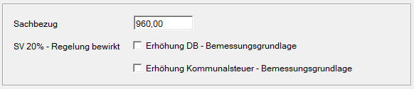

**Sachbezug**

Eingabe des Sachbezugswertes (z. B. für freie Station, PKW-Sachbezug usw.), der vom Nettolohn abgezogen werden soll. Die hier eingegebenen Beträge werden lediglich in Abzug gebracht.

Ist der Sachbezug nicht im Bruttolohn/-gehalt enthalten, so ist dafür eine [eigene freie Lohnart](/lohn/sachbezuege/#3-sachbezugslohnart-anlegen) anzulegen. Erst dann wird der Sachbezug bei der Sozialversicherung sowie bei der Lohnsteuer berücksichtigt.

:::note[Tipp]
Beachtung der Sonderregelung in der Sozialversicherung: Gemäß § 53 ASVG dürfen die dienstnehmerbezogenen SV-Beiträge maximal 20 % seiner Geldbezüge betragen, wird einem Dienstnehmer ein entsprechend hoher Sachbezug in Abzug gebracht, so kann dies Auswirkung auf die dem Dienstnehmer maximal abziehbaren SV-Beiträge haben. Diese Sonderregelung wird vom Programm automatisch berücksichtigt.
:::
