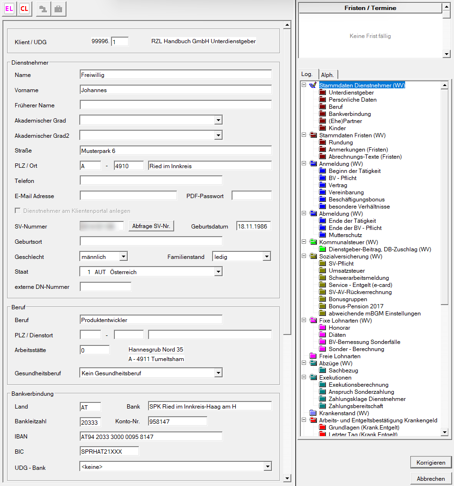

In diesem Bildschirm sind die persönlichen Daten des Dienstnehmers (Name, Adresse usw.), der Beruf, die Bankverbindung, die Angaben zum Ehegatten und zu den Kindern einzugeben.

Es handelt sich um dieselben [Eingabefelder](/lohn/abrechnungsbildschirme/stammdaten-dienstnehmer/) wie bei den normalen Dienstverhältnissen.
