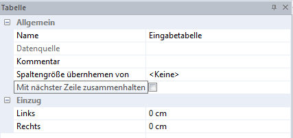

Hier haben Sie die Möglichkeit, die Tabelle selbst zu bearbeiten.

## Name

Hier können Sie den Tabellennamen ändern.

## Datenquelle

Hier können Sie als Datenquelle eine andere Tabelle im Report abrufen. Dies benötigen Sie, wenn Sie für eine Formeltabelle Werte aus einer anderen Tabelle übernehmen wollen.

## Kommentar

Hier können Sie einen Kommentar zur Tabelle hinterlegen.

## Spaltengröße übernehmen von

Über das Drop-down-Menü kann eine andere Tabelle ausgewählt werden. Von dieser Tabelle wird die Spaltengröße auf diese Tabelle übernommen. 

## Mit nächster Zeile zusammenhalten

Mit dieser Funktion werden die Zeilen dieser Tabelle zusammengehalten und nicht getrennt.

## Einzug 

Sie können einen Einzug für *Links* und *Rechts* hinterlegen.
