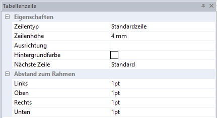

Mit diesem Menüpunkt kann jede Zeile einer Tabelle bearbeitet werden.

## Zeilentyp

Wählen Sie hier den Zeilentyp aus: *Standardzeile*, *Kopfzeile* oder *Fußzeile*.

## Zeilenhöhe

Definieren Sie hier die Zeilenhöhe.

## Ausrichtung

Stellen Sie hier ein, wo der Text der Zeile dargestellt wird: *Oben*, *Zentriert* oder *Unten*.

## Hintergrundfarbe

Wählen Sie eine Hintergrundfarbe aus.

Sie haben auch die Möglichkeit, den Zeilen über eine Formel eine alternierende Farbe zu zuordnen.

## Nächste Zeile

Hier können Sie auswählen, ob das *Standardverhalten* einer Tabellenzeile angewendet, die *Zeile zusammengehalten* oder auf einer *neuen Seite* dargestellt werden soll.

## Abstand zum Rahmen

Stellen Sie hier ein, wie sich der Abstand (*Links*, *Oben*, *Rechts* oder *Unten*) zum Rahmen verhalten soll.
