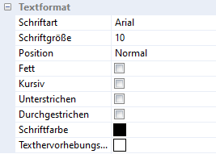
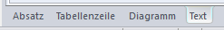

Formatierungen eines Textes können neben der [Werkzeugleiste](/reporting/report-bearbeiten/text-und-absatzbearbeitung/) auch im Texteigenschaftsfenster durchgeführt werden. Das Fenster kann im Menüpunkt *Ansicht / Eigenschaftsfenster / Text* oder im Kontextmenü *Texteigenschaften* aufgerufen werden:

:::note[Tipp]
Sofern Sie bereits mehrere Eigenschaftsfenster geöffnet haben, können Sie im unteren Bereich des Eigenschaftsfensters zwischen den einzelnen Ansichten wechseln:

:::
